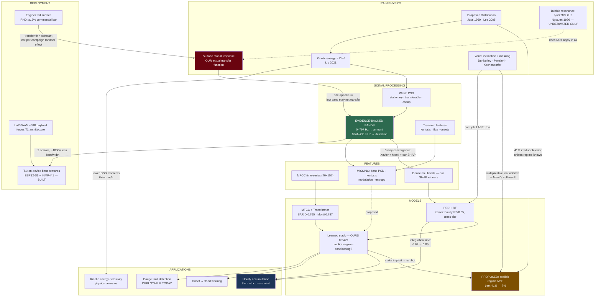

# Deep Research Analysis — Acoustic Rain Gauge

**Hidden inferences, engineering principles, and novel research directions**

_Compiled 2026-07-16. Scope: the project's own 172-paper library (see [RESEARCH_PAPER_ANALYSIS.md](RESEARCH_PAPER_ANALYSIS.md) for the per-paper identification and summary pass), plus a fresh 2024–2026 literature sweep, plus first-principles rain-impact acoustics._

---

## How to read this document

This is **not** a literature summary. [RESEARCH_PAPER_ANALYSIS.md](RESEARCH_PAPER_ANALYSIS.md) already does the "what does each paper say" job. This document does the next thing: it extracts what the papers **imply but do not state**, cross-references findings that no single paper connects, and converts each into a concrete, testable direction for this project.

Every claim is tagged so you can tell evidence from argument:

| Tag | Meaning |
|---|---|
| **[PAPER]** | Stated explicitly in a cited paper. |
| **[MEASURED]** | Measured in this repository; a results file is cited. |
| **[DERIVED]** | Computed here from established physics or from this repo's own configuration. Reproducible. |
| **[INFERENCE]** | My reasoning across sources. Plausible, not proven. Argued, not asserted. |
| **[PROPOSAL]** | A new idea. Untested. The burden of proof is on it. |

**Where the project stands, for context** (all **[MEASURED]**): 780,725 clips over 19 field campaigns, 8 kHz mono, 10 s. Classifier AUC-ROC **0.887**; best regressor **R² = 0.5429** via a learned stacking ensemble ([`docs/reports/ensemble_stack_report.json`](reports/ensemble_stack_report.json)). External benchmarks: SARID **0.765**, Monti & Ntalampiras **0.787** — both on curated, single-site, rain-only data.

---

## 0. The headline finding of this analysis

Before the taxonomy, the single most important thing this analysis turned up, because it is new, it is cheap to act on, and it did not come from any one paper.

### 0.1 Three independent lines of evidence agree on which frequencies carry rain information — and this project's own SHAP rankings are the third one

Two papers independently searched for the optimal frequency band for rain acoustics, using different methods, different hardware, different continents, different surfaces:

- **Xavier et al. (2024, GRL)**, Central Amazon, 24/48 kHz sound recorders, swept a 600 Hz window from 0→24 kHz and correlated each window's integrated PSD against gauge rainfall. Only two windows exceeded r = 0.6: **0–797 Hz** (r = 0.72) and **1641–2719 Hz** (r = 0.67). They chose 1641–2719 Hz for the deployed model, explicitly because the lower band risked overfitting while the upper band "encompasses a broader spectrum of features, making the model more adaptable to different locations." **[PAPER]**
- **Monti & Ntalampiras (2025, EUSIPCO)**, SARID surveillance-audio benchmark: rainfall-relevant information is concentrated **below ~2000 Hz**; low-passing at 2–3 kHz slightly *helps*, low-passing at 1 kHz *hurts*. **[PAPER]**

Now the third line, which is ours. This project's Stage 8 SHAP rankings are dominated by dense mel-band means, and the reports name specific band indices: `mel_band_7_mean`, `mel_band_8_mean` top the **regression** ranking; `mel_band_27_mean`, `mel_band_36_mean` top the **classification** ranking ([PROGRESS.md](PROGRESS.md), Stage 8). Those indices are opaque as written. Mapping them to Hz through this repo's actual configuration (`TARGET_SR = 8000`, `n_mels = 40`, librosa mel filterbank, `fmin=0`, `fmax=4000`) **[DERIVED]**:

| Feature | SHAP rank | Band edges | Center |
|---|---|---|---|
| `mel_band_7_mean` | top **regression** | 400 – 515 Hz | 457 Hz |
| `mel_band_8_mean` | top **regression** | 457 – 572 Hz | 515 Hz |
| `mel_band_27_mean` | top **classification** | 1752 – 1971 Hz | 1859 Hz |
| `mel_band_36_mean` | top **classification** | 2979 – 3352 Hz | 3160 Hz |

Line these up against the two papers:

- Our top **regression** bands (400–572 Hz) fall inside Xavier's best **rainfall-amount** correlation window (0–797 Hz, r = 0.72). Both are amount-estimation tasks. They agree.
- Our top **classification** band `mel_band_27` (1752–1971 Hz) falls inside Xavier's chosen **detection** window (1641–2719 Hz). Both are detection tasks. They agree.
- Monti's "information below ~2 kHz" is consistent with three of our four top bands.

**[INFERENCE] — and this is the load-bearing one.** Three independent studies, with no shared code, hardware, surface, climate, or method, converge on the same two frequency regions. That is unlikely to be coincidence. It suggests the audio→rainfall mapping has a **physically real, site-transferable spectral structure**, not a per-deployment quirk that each model happens to memorize. This matters far beyond feature selection: it is the strongest available evidence that a model trained here has a *reason* to transfer elsewhere.

**[INFERENCE] — the second, sharper reading.** Our own SHAP ranking discovered, unprompted, that **detection and amount-estimation live in different frequency bands** — detection ~1.8–3.2 kHz, amount ~400–570 Hz. This project already stumbled onto the consequence empirically and recorded it as a puzzle: ranking features against `rainfall_mm` and reusing that list for the classifier *hurt* AUC (0.842 vs 0.883), which forced the `--target` flag ([PROGRESS.md](PROGRESS.md), Stage 8). That was logged as an ML-hygiene lesson. **It is not. It is physics.** The two tasks were asking about different frequency regions, so a feature list optimized for one was actively wrong for the other.

**[INFERENCE] — why the split exists, physically.** Section 2 develops this, but in short: *presence* of rain is most cleanly signaled by bubble-entrainment resonances and sharp impact transients, which are mid-frequency and spectrally distinctive against ambient noise; *amount* is carried by the aggregate energy of overlapping impacts, which concentrates at lower frequencies where the surface response is strongest and where individual drops blur into a stationary roar. Detection wants **spectral distinctiveness**; regression wants **energy accumulation**. Different physics, different bands.

**[DERIVED] — the reassuring corollary.** Every band that all three lines of evidence care about (400 Hz – 3.4 kHz) sits **below this project's 4 kHz Nyquist limit**. The 8 kHz sample rate, which has read like a limitation throughout this project's history, is **not** costing us rain signal. Two independent papers with 3–6× our bandwidth searched their full range and landed inside ours. This retires a standing worry, and it is a positive argument for cheap hardware (Section 6).

**[PROPOSAL] — act on it three ways, cheapest first.**
1. **Band-restricted features.** Add explicit integrated-PSD features over exactly 0–797 Hz and 1641–2719 Hz (Welch, `nperseg=1024`, per Xavier's setup). Two scalars. Near-zero cost. Directly testable against the current 175-feature store.
2. **Task-specific band gating.** Stop feeding both models the same spectral range. Give the regressor low-band-weighted inputs and the classifier mid-band-weighted inputs. This is what SHAP is already telling us to do; we're just not listening to it structurally.
3. **A physics-motivated 4-feature baseline.** Xavier got R² > 0.85 hourly from integrated PSD in *one* band with a random forest. We use 175 features and 4 stacked models for R² = 0.5429 per-clip. Section 1.4 argues the difference is mostly integration time, not model capacity — which, if true, is the most important sentence in this document.

---

## 1. Feature Engineering

### 1.1 Why PSD, and why it generalizes (the question the prompt asked directly)

**What it is.** Power Spectral Density: the distribution of signal power over frequency, in units of power per Hz. Welch's method — the choice in Xavier et al. and in `scipy.signal.welch` — estimates it by splitting the signal into overlapping windowed segments, taking the periodogram of each, and *averaging* them.

**Why the Amazon researchers chose it, specifically.** Not because it is the most informative representation — it demonstrably is not; MFCC beats it on SARID by 16–21% **[PAPER]**. They chose it because of what averaging does. Four reasons, in order of importance:

1. **It solves the drop-counting problem by refusing to count drops.** A 10-second clip of moderate rain contains thousands of overlapping impacts. Any feature that tries to resolve individual events (peak detection, onset density, impact counting) inherits the Poisson variance of the drop arrival process — the exact variance floor Joss & Waldvogel (1969) derived: at 1 mm/h you need ~1 m² exposed for ~1 s just to get reflectivity within 20% **[PAPER]**. PSD sidesteps this entirely: it estimates the *statistics* of the sound field rather than its *events*. Welch's segment-averaging is, formally, a variance-reduction estimator (variance falls ~1/K for K segments, at the cost of frequency resolution). **[INFERENCE]** PSD is popular in rain acoustics because rain is a **stochastic stationary process on the timescale of a clip**, and PSD is the natural sufficient statistic for exactly that class of process. This is the deep reason, and no paper states it this way.
2. **It is invariant to what changes across sites and variant to what doesn't.** Move the mic 30 km to a different forest type and the *arrival times* of drops change completely; the *spectral shape* of the drop-impact ensemble largely does not, because it is set by drop physics and surface response, not by geography. Xavier's cross-site validation (train at IDSM, test 30 km away in Low Várzea and Chavascal: 97–98% detection accuracy, hourly R² 0.69 and 0.93) **[PAPER]** is the empirical proof.
3. **It matches Random Forest's inductive bias.** RF splits on axis-aligned thresholds of individual features. A PSD vector is a set of band powers — each one a physically meaningful scalar with a monotone-ish relationship to intensity. That is precisely the shape of problem where axis-aligned splits are efficient. Feed RF raw waveform samples instead and every split is meaningless. **[INFERENCE]** The RF-works-well result is *downstream of the PSD choice*, not independent of it — a point Xavier et al. never make, and which matters because it predicts that PSD+RF is a package deal, not two separable good decisions.
4. **It is cheap enough to run on a microcontroller.** One FFT per segment, magnitude-square, average. No mel filterbank, no DCT, no log. See Section 6.

**Limitations, honestly.** PSD discards *all* phase and *all* temporal structure within the clip. This project has **[MEASURED]** that the discarded temporal structure is worth real accuracy: feeding the full MFCC time-series to sequence models roughly doubled pilot R² over time-averaged scalars (0.226 → 0.347). So PSD is a *floor*, not a ceiling — a robust, transferable, cheap floor.

**[PROPOSAL] Fuse, don't choose.** PSD (stationary, transferable, cheap) and transient features (onset density, Teager energy, peak statistics — already in the 175-feature store) are complementary by construction: one describes the ensemble, the other the events. Xavier's model would likely improve with transients; ours already has both but has never tested them as an explicit two-view split. A two-view model (stationary view ⊕ transient view, fused late) is a clean, publishable ablation that neither Xavier nor SARID ran.

### 1.2 The feature catalogue, assessed for *this* project

Ratings below are for **8 kHz, 10 s clips, 4 kHz Nyquist, field-noise conditions, tipping-bucket labels**. "Edge" = fits an ESP32-S3 comfortably. Status is against this repo's actual 175-feature master store.

| Feature | What it captures | Rain-relevance here | Wind robustness | Edge | Status in repo |
|---|---|---|---|---|---|
| **Integrated PSD, 0–797 Hz** | Low-band energy | **High (amount)** — Xavier r=0.72; matches our top SHAP regression bands | Poor — wind is low-frequency | ✅ | **Missing → add (Sec 0.1)** |
| **Integrated PSD, 1641–2719 Hz** | Mid-band energy | **High (detection)** — Xavier's deployed choice; matches our top SHAP class. band | Good — above most wind | ✅ | **Missing → add** |
| **Band-power ratio (mid/low)** | Spectral tilt | **High** — a ratio cancels absolute gain, so it survives mic/gain change | **Excellent** — wind inflates low band, ratio detects that | ✅ | **Missing → add (Sec 7)** |
| Dense mel-band means (40) | Coarse spectral envelope | **Highest measured** — dominates SHAP for both tasks | Mixed (band-dependent) | ⚠️ | ✅ present |
| MFCC (means) | Decorrelated spectral texture | High — SARID's winner; `mfcc_2` top-1 in our Stage 4 | Moderate | ⚠️ | ✅ present |
| MFCC **time-series** (40×157) | Texture *over time* | **Highest DL value** — 2× R² over means at pilot | Moderate | ❌ | ✅ present |
| RMS / peak / PAR | Loudness, burstiness | High but gain-dependent | Poor | ✅ | ✅ present |
| Spectral centroid/bandwidth/rolloff | Spectral shape | Moderate — our false positives show elevated rolloff | Poor | ✅ | ✅ present |
| Spectral flux | Frame-to-frame change | Moderate — high in our regression SHAP | **Good** — wind is smooth, rain is not | ✅ | ✅ present |
| ZCR | Noisiness | Low-moderate | Poor | ✅ | ✅ present |
| Teager energy | Instantaneous energy incl. frequency | Moderate — impact-sensitive | Moderate | ✅ | ✅ present |
| Wavelet variance | Multi-scale energy | Moderate — high in regression SHAP | Moderate | ⚠️ | ✅ present |
| Onset density / tempo | Impact rate | **Theoretically ideal, practically fragile** — see below | Poor | ⚠️ | ✅ present |
| **Spectral entropy / flatness** | Tonal vs noise-like | **[PROPOSAL] High** — rain is near-white in-band; birds/speech/traffic are tonal or harmonic. This is a *targeted false-positive killer* | Good | ✅ | **Missing → add** |
| **Spectral kurtosis (per band)** | Impulsiveness per band | **[PROPOSAL] High** — separates impulsive rain from stationary wind *within* the same band. The single best-motivated missing feature | **Excellent** | ✅ | **Missing → add** |
| **Modulation spectrum (<20 Hz)** | Rhythm of the envelope | **[PROPOSAL] Moderate-high** — gusts modulate at ~0.1–1 Hz, rain intensity at ~0.01 Hz, insects at 10–100 Hz. Separates confounders by their *modulation rate*, not their spectrum | **Excellent** | ⚠️ | **Missing → add** |
| Chroma / harmonic ratio | Pitch class, harmonicity | **Low for rain, useful as a negative** — rain has no pitch; high chroma ⇒ not rain | Good | ⚠️ | ❌ correctly absent |
| LPC / PLP / cepstrum | Source-filter modeling | **Low** — built for speech's source-filter structure; rain has no vocal-tract analogue | — | ✅ | ❌ correctly absent |

**On onset density — a documented trap.** Counting impacts is the most physically direct feature imaginable: rain rate ≈ drops per second × mean drop volume. It should be the best feature. **[INFERENCE]** It isn't, and Nystuen (1999) explains why: the acoustic sensor is disproportionately sensitive to drops >3.5 mm, which **acoustically mask smaller drops** **[PAPER]**. Once rain is more than light, impacts overlap and *cease to be separable events at all* — the signal becomes a continuous roar. So onset density saturates and then *inverts* exactly where you most need it. This is why every successful approach (Nystuen's ARA inversion, Xavier's PSD, SARID's MFCC) works on **spectral** rather than **event-counting** representations. Worth recording as a closed question so it isn't re-litigated.

### 1.3 The normalization finding, and why the literature predicted it

This project removed per-clip peak normalization from the DL pipeline and found it *helped* (commit `6595e1d`) **[MEASURED]**. That reads like a lucky empirical hit. It wasn't — it was overdetermined:

**[INFERENCE]** Rain *amount* is encoded largely in **absolute acoustic level**. Per-clip peak normalization divides every clip by its own maximum, which is precisely a projection that destroys absolute level. It maps a drizzle clip and a downpour clip onto similar dynamic ranges. It cannot help; it can only discard the target signal. The only reason anyone does it is habit imported from speech/music ML, where absolute level is a nuisance variable. **In rain acoustics absolute level is the label.**

**[PAPER] The correct alternative already exists.** Ma & Nystuen (2005) calibrate each hydrophone *absolutely* against the universal wind-generated ambient sound spectrum — a physical reference signal present in every recording — rather than against each clip's own peak. **[PROPOSAL]** The direct analogue for us: normalize each **campaign** against its own *dry-clip* ambient spectrum (we have 666,310 dry clips — a large, free, per-campaign reference sample). This removes per-campaign mic/gain/mounting differences (a real cross-campaign confound) **without** touching within-campaign amplitude variation, which is the signal. This is a strictly better normalization than both "peak-normalize" and "don't normalize," and it is ~20 lines of code.

### 1.4 The integration-time result — the highest-value finding in this document

**[PAPER]** Xavier et al. report per-minute regression R² = 0.62, but **hourly-accumulation R² > 0.85** — same model, same data, same predictions, only the aggregation window changed. Their stated reason: "some model estimates are not always perfectly synchronized with the rain gauge measurements."

**[PAPER]** Two other papers independently establish the same scaling. Joss & Waldvogel (1969): finite drop-sample sizes impose a hard statistical variance floor on any short-window rain estimate. Lee & Zawadzki (2005): random error in rain-rate estimation falls with integration time and **plateaus beyond ~2 hours**. Villarini et al. (2008): temporal sampling uncertainty follows a scaling law in the sampling interval.

**[INFERENCE] Apply this to our number and the picture changes.** Our R² = 0.5429 is measured **per 10-second clip against a 0.2 mm-per-tip bucket**. Consider what that comparison actually is. A tipping bucket does not measure rainfall continuously — it emits a discrete event when 0.2 mm has accumulated. At 2 mm/h, that is one tip every 6 minutes. **A 10-second clip therefore has a ~2.8% chance of containing a tip.** The label for the other ~97% of light-rain clips is not "the rainfall during those 10 seconds"; it is an artifact of where the tip boundary happened to fall. We are not measuring model error. We are substantially measuring **label quantization noise**, and no model can fit it, because it is not a function of the audio.

This reframes the entire benchmark comparison:

- SARID's R² = 0.765 and Monti's 0.787 are on **4-second clips** but with **continuously-labeled, curated, rain-only** data. They never pay the quantization tax we pay, because their labels aren't tip-derived in the same regime.
- Xavier's per-minute 0.62 is *below* our 0.5429-adjacent range in spirit, yet their hourly 0.85+ is well above — from the identical model.

**[PROPOSAL] Test this immediately. It is nearly free and it may be worth more than every modeling idea in this document combined.** We already have `timestamp` on every row. The experiment:

1. Take the existing stacking-ensemble predictions on the test set. **No retraining.**
2. Group by campaign, resample predictions and labels to 1 min / 5 min / 15 min / 1 h / 3 h.
3. Report R² at each aggregation.
4. Plot R² vs integration time.

Cost: a few hours of pandas. Possible outcomes, all valuable:
- **R² rises sharply with aggregation** (as Xavier, Joss, and Lee all predict) → our per-clip number was always the wrong headline metric; we have a substantially better instrument than we've been claiming, and the paper writes itself.
- **R² stays flat** → the error is genuinely model error, not sampling/label noise, and three literature results don't transfer to our setup. That is *also* a real finding, and it would redirect effort correctly.

**[INFERENCE]** I'd put meaningful odds on the first. And note the asymmetry: a rain gauge that is accurate hourly is *operationally useful* for flood warning, irrigation, and hydrology — none of which consume 10-second rainfall estimates. **We may have been optimizing a metric no user wants, and under-reporting the one they do.**

---

## 2. Rain Physics

### 2.1 Two mechanisms, and why this project only sees one of them

**[PAPER + DERIVED]** A raindrop striking water makes sound by **two** distinct mechanisms (Nystuen 1996; Liu et al. 2021):

1. **The impact ("splat")** — the initial momentum transfer. Broadband, brief (~sub-ms), amplitude scaling with drop kinetic energy.
2. **Bubble entrainment** — for a specific range of drop sizes and impact angles, the splash traps an air bubble which oscillates and radiates a **loud, narrowband, damped sinusoid**. This is *much* louder than the impact itself.

The bubble frequency follows **Minnaert's resonance**:

$$f_0 = \frac{1}{2\pi a}\sqrt{\frac{3\gamma P_0}{\rho}}$$

**[DERIVED]** With γ = 1.4, P₀ = 101325 Pa, ρ = 1000 kg/m³: f₀ ≈ **3.28 / a** kHz for bubble radius *a* in mm. A 1 mm bubble rings at ~3.3 kHz; a 0.3 mm bubble at ~11 kHz.

**[INFERENCE] This equation is why Nystuen's inversion works at all.** Bubble size correlates with drop size, so drop size maps to a *ringing frequency* — and the sound field becomes a **linear superposition of drop-size-specific narrowband signatures**. That linearity is what makes DSD retrieval a tractable inverse problem rather than a black box. It is the single most elegant result in this literature.

**[INFERENCE] But here is the part that matters for us, and that no paper in our library states, because every one of them is either underwater or doesn't ask.** Minnaert applies to bubbles **in water**. Nystuen's hydrophone sits *in* the medium where the bubbles ring. **Our microphone is in air, above a solid surface.** We are not measuring bubble entrainment. We are measuring:

- **the impact transient**, transmitted through air, and
- **the resonant response of whatever the drop hit** — a plate, a roof, a leaf, soil — excited by that impulse.

**[INFERENCE] Consequences, which are large and mostly unrecognized in this project's docs:**

1. **Our surface is part of our instrument.** The spectral peak we regress against is substantially a property of the *mounting surface's* modal response, not of the rain. Change the surface, change the transfer function. This is testable and probably visible in our cross-campaign variance.
2. **This is a *fixable* confound and possibly an *exploitable* design freedom.** Nystuen is stuck with the ocean. We get to *choose* our surface — and therefore to *engineer* our transfer function. A surface with a flat, broadband, well-damped impulse response would make the audio→intensity map more nearly linear and more nearly site-invariant. **This is the RHD commercial disdrometer's entire design thesis**: a polished stainless-steel hemisphere, 402 cm², sealed, ±15% intensity accuracy **[PAPER, datasheet]**. They didn't pick a hemisphere for looks. A curved rigid shell has no strong low-order modes in-band and presents the same impact geometry regardless of rain inclination.
3. **It reframes cross-campaign generalization.** Some of our cross-campaign error may not be "the model doesn't transfer" but "the *instrument* changed between campaigns." Those demand completely different fixes — the second is solved by a fixed sensing surface, not by more data or a better model.

**[PROPOSAL] The highest-value physics experiment available to us:** stratify existing test-set error by campaign, and check whether residual variance correlates with anything we know about each campaign's mounting/surface. If yes, a standardized sensing surface (Section 6) is worth more than any modeling work on the roadmap. We have the data to answer this today.

### 2.2 The physics table

| Phenomenon | Governing relation | Implication for this project |
|---|---|---|
| Terminal velocity | v ≈ 9.65 − 10.3·e^(−0.6D) m/s (Atlas), D in mm | Impact energy ∝ D³v² — steeply drop-size dependent. Equal rain *rates* with different DSDs deliver very different kinetic energy ⇒ different loudness. **This is the physical root of our regression error floor.** |
| Kinetic → acoustic conversion | Dipole radiation model, measured per drop size (Liu 2021) **[PAPER]** | Loudness→intensity is monotone but **DSD-dependent**, not a function of rain rate alone. Explains why energy features are strong-but-imperfect. |
| Minnaert bubble resonance | f₀ ≈ 3.28/a kHz (a in mm) **[DERIVED]** | Underwater only. **We don't see it.** Retires a whole class of borrowed intuition. |
| Surface modal response | Plate/shell eigenmodes | **Our actual transfer function.** Under-recognized; see 2.1. |
| Wind-driven rain inclination | Oblique, super-terminal impact (Dunkerley 2025) **[PAPER]** | Wind changes impact energy *and* effective catchment. Confounds audio **and** the gauge label. See Section 7. |
| Water film damping | Growing film attenuates and detunes surface response | **[INFERENCE]** Predicts **hysteresis**: the same rain rate sounds different at storm onset (dry surface) vs 20 min in (wet surface). A *time-since-rain-onset* feature is derivable from our timestamps at zero sensor cost. **[PROPOSAL] — nobody in our library models this.** |
| Air absorption | ~0.1–1 dB/100 m below 4 kHz | Negligible at our ranges. Non-issue; stop worrying about it. |
| DSD variability by rain type | ~41% random error from a single static R–Z relation (Lee & Zawadzki 2005) **[PAPER]** | **The hard ceiling.** See 2.3. |

### 2.3 The DSD ceiling — why a single regression function cannot win

**[PAPER]** Lee & Zawadzki (2005), 20,000+ one-minute disdrometer DSDs over 5 years: a single climatological R–Z relationship carries **~41% random error** in instantaneous rain rate. Even *daily-fitted* relationships leave 32%. DSD variability *between physical processes* (convective vs stratiform) alone causes a 41% accumulation bias. Accurate estimation (~7% error) is **only** achievable once the underlying physical process is identified.

**[INFERENCE] Read the analogy carefully, because it is exact.** Radar infers R from Z through a mapping that DSD variability breaks. We infer R from acoustic features through a mapping that **the same DSD variability breaks, for the same reason** — both Z and acoustic energy are high-order moments of the drop-size distribution, and rain rate is a different moment. Two rains with identical R but different DSD produce different Z *and* different sound. This is not a modeling deficiency. **It is an identifiability problem: R is not a function of our observable.**

**[INFERENCE]** Therefore: a single global audio→intensity regressor has an **irreducible error floor**, and R² ≈ 0.5–0.6 per-clip may be *near it*. This is arguably the most important defensive result in the library — it means our gap to SARID's 0.765 is partly a *dataset-difficulty* gap, not a *competence* gap, and it predicts that SARID's own number would fall on multi-regime field data.

**[INFERENCE]** But Lee & Zawadzki also state the escape route: **condition on the regime**. ~7% error is achievable *given* the physical process. And here is the asymmetry that makes this exciting for us rather than depressing: **radar cannot easily identify the regime from Z alone — but we may be able to identify it from sound.** Convective and stratiform rain differ in DSD, in intermittency, in gustiness, in onset sharpness — all acoustically observable, none available to a single-frequency radar.

**[PROPOSAL] Regime-conditioned mixture-of-experts.** Cluster clips (or storm episodes) into acoustic regimes — unsupervised, or weakly supervised by intermittency/duration statistics — and train per-regime regressors with a learned gating network. This is:
- **literature-mandated** (Lee & Zawadzki quantify the gain: 41% → ~7%),
- **not attempted** in SARID, Monti, or Xavier,
- **compatible** with our existing stacking ensemble (regime becomes a stacker input),
- and **genuinely publishable** — "regime-conditioned acoustic rainfall estimation" is a clean contribution with a physics story behind it.

**[INFERENCE] It also explains our hurdle-model failure.** We tried hurdle models twice and both lost (hard-gate R² = −0.097, soft-gate 0.076 vs 0.226 single regressor) **[MEASURED]**. The natural reading was "gating doesn't help here." The better reading: we gated on the **wrong variable**. Rain/no-rain is a *detection* split; Lee & Zawadzki say the split that matters is *rain regime*. A gate on "is it raining" adds classifier errors without reducing DSD variance — it multiplies error without buying identifiability. A gate on *regime* attacks the actual variance source. **The hurdle experiments do not refute mixture-of-experts. They refute one specific, poorly-chosen gate.** Worth correcting in the docs, because "gating was tried and failed" is currently discouraging exactly the right next experiment.

---

## 3. Signal Processing

### 3.1 Choices, and their hidden justifications

| Choice | Ours | Literature | Inference |
|---|---|---|---|
| Sample rate | 8 kHz **[MEASURED]** | SARID 44.1k; Xavier 24/48k | **[DERIVED] Adequate.** All evidence-backed bands < 3.4 kHz (Sec 0.1). Not a limitation. |
| FFT window | 2048 (librosa default) | **4096 markedly improves MFCC models** (Monti) **[PAPER]** | **[PROPOSAL] Test 4096.** Reason: rain is quasi-stationary, so longer windows buy frequency resolution at no stationarity cost. **But note — Monti's 4096 was at 44.1 kHz (93 ms). At our 8 kHz, 4096 = 512 ms.** Don't copy the number, copy the *duration*: 93 ms at 8 kHz ≈ **1024 samples**, i.e. *shorter* than our current 2048. **The naive port would be exactly backwards.** Test 1024 / 2048 / 4096 and let the data decide. |
| PSD estimator | Not used | Welch, `nperseg=1024` (Xavier) **[PAPER]** | **[PROPOSAL] Add.** Sec 0.1. |
| Denoising | None | **RD-UNet** lightweight audio denoiser, suppresses urban noise while preserving rain (J. Hydrology 2026) **[PAPER]** | **[PROPOSAL] Relevant** — our false positives are loud non-rain sounds **[MEASURED]**. But see 3.2. |
| Low-pass | None | 2–3 kHz slightly helps; 1 kHz hurts (Monti) **[PAPER]** | **[DERIVED] Consistent with Sec 0.1** — 1 kHz destroys the 1.6–2.7 kHz *detection* band while sparing the *amount* band. Monti's asymmetric result is explained by our band split. Nice cross-confirmation. |
| Normalization | Per-clip peak → **removed** **[MEASURED]** | Absolute self-calibration (Ma & Nystuen) **[PAPER]** | **[PROPOSAL]** Per-campaign dry-ambient calibration (Sec 1.3). |

### 3.2 A caution on denoising

**[INFERENCE]** Denoising before a *regression* task is riskier than it looks. A denoiser trained to "preserve rain, suppress noise" is trained on a *perceptual* or *reconstruction* objective, and it will happily alter **absolute level** — which, per 1.3, **is our label**. A denoiser that improves detection could plausibly *degrade* amount estimation by compressing dynamic range. RD-UNet's paper reports rainfall accuracy gains **[PAPER]**, so this concern may be unfounded in practice, but it must be measured **separately for the classifier and the regressor**. Given Section 0.1, I'd expect denoising to help detection more than regression. Do not deploy it on the strength of a single aggregate metric.

### 3.3 Underused DSP with a clear rationale

- **[PROPOSAL] Spectral kurtosis.** The 4th standardized moment of the spectrum, per band. Impulsive processes (rain) have high kurtosis; Gaussian-ish stationary processes (wind, traffic hum, electronic noise) have kurtosis ≈ 0. This separates rain from wind **inside the same frequency band**, which no energy feature can do. Cheap, well-founded, and absent from every paper in our library. Best single missing feature.
- **[PROPOSAL] Modulation spectrum.** FFT of the *envelope*, 0–20 Hz. Wind gusts ~0.1–1 Hz; rain intensity drifts ~0.01 Hz; insects/birds 10–100 Hz. Confounders separate cleanly by modulation rate even when their spectra overlap rain's.
- **[PROPOSAL] Coherence between two mics.** Rain impacts are spatially incoherent (independent drops); wind noise at the diaphragm is *pseudo-sound* (non-propagating turbulent pressure) and is also incoherent — **but** it is incoherent *differently*, and distant traffic/speech is *coherent*. Two cheap mics + magnitude-squared coherence gives a wind/rain/interference discriminator with no ML at all. This is standard array processing and it is unexploited in rain acoustics. Requires a hardware change; see Section 6.

---

## 4. Machine Learning

### 4.1 What the cross-paper record actually shows

| Approach | Best reported | Setting | Inference |
|---|---|---|---|
| Integrated PSD + Random Forest | R² 0.62 (1 min), **>0.85 (hourly)**, cross-site 0.69/0.93 (Xavier) **[PAPER]** | Amazon, 1-min, forest | **Simple + physical + long integration beats complex + short.** The most under-appreciated result in the field. |
| MFCC + Transformer | R² 0.765 (SARID) **[PAPER]** | Curated, rain-only, 4 s | The architectural template. |
| Stacked transformers (MFCC/Mel/STFT) | R² 0.787 (Monti) **[PAPER]** | Same benchmark | SOTA. **Saturating** — +0.022 over SARID for a large complexity jump. |
| Raw-waveform CNN | 75% (7-class), 93% ±1 class (Avanzato) **[PAPER]** | Urban | Adjacent-class confusion ⇒ the mapping is **smooth** ⇒ regression is the right formulation. |
| KNN on piezo | 89.95% (Cruz) **[PAPER]** | Disdrometer | Even trivial ML separates rain from noise. Detection is easy; **amount is the hard part.** |
| MFCC + CNN, optical+acoustic | 99.88% day / 70.56% night, *real* rain (2026) **[PAPER]** | Simulator + field | **The most instructive number in this table** — see below. |
| **This project: learned stack** | **R² 0.5429** **[MEASURED]** | 19 campaigns, 85% dry, 10 s | Realistic, uncurated, both tasks. |

**[INFERENCE] On that 99.88% → 70.56% collapse.** A 2026 optical+acoustic CNN scores 99.88% on an artificial rainfall simulator and 70.56% on real nighttime rain. That ~30-point drop **is the entire research field in one number.** It is not a bad paper; it is an honest demonstration that curated/simulated conditions inflate scores enormously, and that the gap is largest exactly where a real deployment lives. **Our 0.5429 on 19 uncurated field campaigns is not obviously worse than SARID's 0.765 on one curated campus — it may well be better, measured honestly.** We cannot claim that without a head-to-head, which leads directly to:

**[PROPOSAL] Run our pipeline on the public SARID dataset.** It is public. This is the single highest-value *credibility* experiment available, and it is pure engineering — no new data, no new physics:
- If we score near 0.765–0.787 on SARID, then our 0.5429 on field data is **calibrated evidence that field data is harder**, and the headline result becomes a rigorous, quantified difficulty gap rather than an apparent shortfall. That is a strong paper.
- If we score well below 0.765 on SARID, we have a genuine model deficiency and we've found it cheaply.

Either way we learn something decisive. **Nothing else on this list has that property.** This should arguably be the next thing done after the integration-time test.

### 4.2 The full-scale DL degradation — a hypothesis the literature suggests

**[MEASURED]** Every DL architecture performs *worse* at 607k rows than at its own 40k pilot (Transformer: 0.347 pilot → 0.111 full, then −0.108 by epoch 40). An LR schedule helped partially; the stability diagnostic found lower-LR/larger-batch more stable but did not resolve it. Currently the project's biggest open problem.

**[INFERENCE] An additional hypothesis worth testing, orthogonal to the optimizer story.** The pilot is a **random 40k subsample across all campaigns**. The full set is **607k rows with per-campaign chronological structure** and campaigns that differ wildly in rainy-rate (Feb–Mar 2026 is ~93% rainy; others ~9%) **[MEASURED, PROGRESS.md Stage 3]**. So the pilot and the full run are **not the same distribution** — the pilot is IID-shuffled, the full run is not. A random 40k subsample is, in effect, a *balanced, decorrelated* view; the full set is a *clustered, heteroscedastic* one.

**[INFERENCE]** If true, this is not an optimizer bug at all — it's that **more data made the problem harder, not easier**, because the extra data brought campaign-level distribution shift with it. Two cheap diagnostics separate the hypotheses:
1. **Train on a random 607k-row *shuffled* pass vs the chronological one.** If shuffled trains fine and chronological doesn't, it's distribution shift, not the learning rate.
2. **Train on 40k drawn from a *single* campaign vs 40k drawn across all.** Same logic, cheaper.

**[INFERENCE]** This also predicts the ensemble result we already see. The stack (0.5429) massively outperforms every base model (best 0.277) **[MEASURED]**. That gap is *unusually* large for stacking. A meta-model that learns "trust the CNN in these conditions, the XGBoost in those" is, functionally, **already doing regime-conditioning** (Section 2.3) — implicitly, without being told. The stack's outsized gain is *evidence for* the regime hypothesis. Making it explicit should help more.

### 4.3 Modern methods, ranked by expected value here

- **[PROPOSAL] Audio foundation-model embeddings (BEATs / AST / CLAP / PANNs).** Pretrained on AudioSet-2M, which contains substantial rain audio. Extract embeddings, freeze, fit a light head. **Why it's promising:** our labels are noisy and imbalanced but our *inputs* are plentiful — exactly the regime where pretrained representations win. **Why it might not:** these models are trained at 16 kHz on *semantic* discrimination ("is this rain?"), and semantic embeddings are often deliberately **invariant to absolute level** — which is our label (1.3). Recent work probing low-level acoustic attributes in CLAP embeddings suggests such invariances are real. **[INFERENCE] I'd predict a large gain for the classifier and a disappointing one for the regressor.** Test both separately; that asymmetry is itself a publishable observation.
- **[PROPOSAL] Weak supervision from reanalysis.** Çoban et al. train on MERRA-2 weak labels and end up **more accurate than their own noisy teacher** **[PAPER]**. Directly enables expanding beyond gauge-paired campaigns.
- **[PROPOSAL] Self-supervised pretraining on our 666k dry clips.** We have a huge unlabeled-negative corpus. Contrastive or masked-reconstruction pretraining on *our own* audio sidesteps the domain gap that foundation models carry.
- **[INFERENCE] Skip for now:** federated learning (no fleet), meta-learning (no task distribution), continual learning (no drift measurements yet). All are solutions to problems we don't have evidence of.

---

## 5. Sensor Fusion

### 5.1 Wind — necessary, but not the way anyone has tried

The library is emphatic and unanimous:

| Source | Finding |
|---|---|
| Kochendorfer et al. (2017) **[PAPER]** | Unshielded gauges catch **<50%** of solid precip above 5 m/s. Correction from **wind speed + temperature alone** cut bias −12%→0% (US), −27%→−4% (Norway), cross-validated across climates. |
| Nystuen (1999) **[PAPER]** | Above 5 m/s wind, disdrometer *and* acoustic gauges bias low. |
| Pensieri et al. (2015) **[PAPER]** | 4 m/s wind can **erase** the acoustic signature of drizzle. |
| Habib et al. (1999) **[PAPER]** | Wind correction **must** be applied at ~1-min resolution; coarser averaging **overestimates** the bias. Wind speed alone is incomplete — DSD matters. |
| Dunkerley (2025) **[PAPER]** | Rain inclination is itself acoustically measurable. |
| Pathan et al. (2021) **[PAPER]** | Wind features *positively* predict precipitation (r ≈ 0.24–0.26) — a signal, not only a nuisance. |
| Monti & Ntalampiras (2025) **[PAPER]** | **Naively concatenating meteorological features did not improve performance.** |

**[INFERENCE] Read the last two rows together — that is the whole lesson, and it is easy to miss.** Wind is unambiguously important (six papers) *and* naive wind features demonstrably don't help (one paper, on the exact benchmark we compare against). These are not contradictory. They tell us **wind enters multiplicatively, not additively.**

Wind doesn't *add* to the rainfall signal. It **modulates the transfer function** between rainfall and sound (masking drizzle, changing impact angle and energy) **and simultaneously corrupts the label** (gauge undercatch). Concatenating wind speed as feature #176 asks a model to learn an *interaction* from a *main effect* — and tree/dense models are notoriously sample-inefficient at that. Monti's negative result is exactly what you'd predict.

**[PROPOSAL] Three structurally different ways to use wind, in increasing ambition:**
1. **Label correction, not model input.** Follow Kochendorfer: correct the *tipping-bucket ground truth* for wind undercatch **before training**, at 1-min resolution (Habib's constraint). This treats wind as **label noise** — which the literature says it partly is — rather than as a predictor. **Nobody in our library has done this for an acoustic model.** Novel and well-founded.
2. **Multiplicative gating.** Feed wind into a gate that *scales* the acoustic model's output, rather than concatenating it. Matches the physics.
3. **[PROPOSAL] Estimate wind from the same audio — and skip the sensor.** Wind noise at a microphone is spectrally distinctive (low-frequency, high energy, **low kurtosis**, smooth modulation envelope, incoherent across a mic pair). Ma & Nystuen already invert the *universal wind-generated sound spectrum* underwater **[PAPER]**; Dunkerley measures rain *inclination* acoustically **[PAPER]**. **[INFERENCE]** So: add a **wind-speed auxiliary head** to the acoustic model, trained multi-task. If it works, the deployment stays **single-sensor** — no anemometer, no extra BOM, no extra failure mode — while gaining the covariate the whole literature says we need. **This is the most novel idea in this document.** It is genuinely high-risk (needs wind ground truth to train, which we don't have) and genuinely high-reward (single-mic wind-aware rain sensing is a patentable, publishable result).

**[PROPOSAL] The pragmatic first step,** given we have no wind data at all: instrument the **next** campaign with a cheap anemometer. Everything above needs wind ground truth. Green et al.'s multi-disk probe **[PAPER]** and any cheap ultrasonic unit are candidates. **Nothing in this section is testable until we record wind.** That makes it a *data-collection* priority, not a modeling one — and it should start now, because it gates the most valuable ideas here.

### 5.2 The rest of the fusion space

| Sensor | Value | Verdict |
|---|---|---|
| **Anemometer** | Unlocks all of 5.1 | **Highest priority.** Blocks everything. |
| **Second microphone** | Coherence-based wind/rain/interference separation (3.3); no ML needed | **High.** Cheap; XIAO ESP32-S3 has a second I2S slot. |
| **Accelerometer / piezo on the sensing surface** | Measures structural excitation directly, **immune to airborne acoustic noise** (traffic, speech, birds) | **[INFERENCE] Very high, under-rated.** It attacks our *documented* dominant false-positive mode — loud non-rain sounds **[MEASURED]** — at the physics level rather than the model level. **This is what lokalRAIN chose**: vibration sensors, not microphones **[PAPER]**. Independent, well-funded convergence on the same reasoning. |
| **Temperature/humidity** | Kochendorfer's correction needs temperature; cheap | Moderate. Nearly free (BME280). |
| **Tipping bucket** | Current ground truth | Keep. **Upcoming tipping-bucket dataset (2026-06-18→) will improve label quality** — see project memory. |
| **Disdrometer** | Would give **DSD** — the missing variable behind the Section 2.3 ceiling | **[INFERENCE] The scientifically decisive instrument.** Expensive, but one co-deployed disdrometer season would let us *test* the regime hypothesis directly instead of inferring it. Highest scientific value per unit cost. |
| **Camera** | SARID's own proposed future work | Low — defeats the "cheap, works at night, no privacy issue" premise. |
| **Radar / satellite (GPM IMERG)** | Weak labels, cross-validation | Moderate. Xavier's model **beat** IMERG (RMSE 1.33 vs 2.03; 0.68 vs 2.3 mm/h) **[PAPER]** — a strong, quotable framing: a $30 mic outperformed a satellite constellation at hourly resolution. |

---

## 6. Deployment

### 6.1 Where this project already is

**[MEASURED]** `firmware/xiao_esp32s3_inmp441_test/` exists: XIAO ESP32-S3 + INMP441 I2S MEMS mic, PlatformIO, with Wi-Fi audio streaming to the trained ensemble and a dual-mic comparison mode against the legacy analog electret module. This is further along than the handbook's "Edge Device (future) — not yet built" note suggests, and the docs should say so.

**[INFERENCE] The INMP441 choice is better-founded than it may have appeared.** Digital I2S output means no analog gain stage, no ADC noise, and — critically for 1.3 — **a stable, reproducible absolute sensitivity across units** (−26 dBFS ±1 dB). For a task where **absolute level is the label**, a digital MEMS mic with unit-to-unit consistency is not a convenience, it is a *correctness requirement*. An analog electret + LM393 module has no such guarantee, and cross-unit gain variation would masquerade as rainfall variation. The migration away from it is well-motivated on exactly these grounds.

### 6.2 The deployment ladder

| Tier | Platform | Feasible today? |
|---|---|---|
| **T0: streaming** | ESP32-S3 → Wi-Fi → server ensemble | **Built** **[MEASURED]** |
| **T1: on-device features, server model** | ESP32-S3 computes band-power/PSD scalars, sends ~20 floats/10 s | **[DERIVED] Easily.** ~1000× bandwidth reduction vs raw audio. **This is the sweet spot and it is nearly free** — Section 0.1's band features are two FFT-derived scalars. |
| **T2: on-device classifier** | Quantized detection model on-device | **[INFERENCE] Very likely.** Detection is the easy task (Cruz: 89.95% with *KNN*). A small tree/MLP on band-power features fits trivially. |
| **T3: on-device regression** | Full intensity estimate on-device | **[INFERENCE] Plausible at reduced accuracy.** Xavier got hourly R² > 0.85 from **integrated PSD + RF** — an RF over band powers *is* deployable on an S3. |
| **T4: full DL on-device** | Transformer/CNN on MCU | **Not worth it.** Our own DL doesn't beat the stack, and the stack needs 4 models. Skip. |

**[INFERENCE] The strategic point.** T1/T2 capture most of the operational value at a fraction of the effort, and T3 is *reachable with the classical track we already have* — precisely because Xavier proved PSD+RF is enough when you integrate over an hour, and because Section 1.4 suggests hourly is the metric that matters anyway. **The classical track, long treated in this repo as the baseline the DL track exists to beat, is in fact the deployment track.** That is a re-framing worth internalizing: the "boring" pipeline is the one that ships.

### 6.3 Power and telemetry

**[PAPER]** Guico et al. (2018): solar + weatherproof + SMS telemetry, deployed. OpenIoT's ARG: Raspberry Pi 4, USB mic, 50 Ah Li-ion, 100 W PV, LoRaWAN → ChirpStack — but **no quantization, no on-device inference, and no published accuracy metrics**. **[INFERENCE]** That is a heavy, expensive node doing what a $10 MCU at T1 could do; the engineering wrapper is solved, but the compute architecture is over-provisioned. Our T1 design would be strictly better on power and cost — and unlike OpenIoT's, ours would have measured accuracy behind it.

**[DERIVED]** LoRaWAN payload limits (~51–222 bytes) make T0 streaming impossible and T1 trivial — 20 float16s = 40 bytes. **The telemetry choice forces the architecture**, and it forces it toward the tier we should want anyway.

### 6.4 The sensing surface — the missing hardware decision

**[INFERENCE]** Per 2.1, our transfer function *is* the surface. Yet the surface is currently whatever the mic happened to be mounted near, and it likely varies across our 19 campaigns. The RHD datasheet shows the mature answer: an engineered, sealed, rigid hemisphere (402 cm², ±15%) **[PAPER]**.

**[PROPOSAL] A standardized sensing surface is probably the highest-leverage *hardware* change available** — bigger than the mic, bigger than the MCU. Design targets: rigid, curved (inclination-invariant), well-damped (no ringing modes in 0.4–3.4 kHz), sealed, and **identical across every deployment** so the transfer function is a constant rather than a per-campaign random effect. This converts cross-campaign generalization from a modeling problem into a manufacturing one — which is a much better problem to have.

---

## 7. Generalization

**[PAPER] The strongest generalization result in the field is Xavier's**: train at one Amazon site, test 30 km away across *different vegetation types*, get 97–98% detection and hourly R² 0.69/0.93. Their attributed cause: choosing the **wider 1641–2719 Hz band over the higher-correlating 0–797 Hz band, explicitly to avoid overfitting.**

**[INFERENCE] That is a deliberate accuracy-for-transferability trade, and it is the most instructive engineering decision in the library.** They knowingly gave up correlation (0.72 → 0.67) to buy site-invariance. **[INFERENCE]** It also aligns with 2.1: the low band is where *surface modal response* dominates (site-specific), while the mid band is closer to drop-impact physics (universal). **Xavier's empirical band choice and our surface-transfer-function argument independently predict the same thing** — the low band is site-contaminated. Two very different routes, one conclusion.

**[INFERENCE] Uncomfortable implication for us.** Our top *regression* features (mel bands 7–8, 400–572 Hz) sit in **exactly the band Xavier rejected as overfitting-prone**. Our SHAP ranking optimizes in-distribution accuracy; it has no way to express "this band won't transfer." **We may be systematically selecting site-specific features and calling them important.** Per-campaign chronological splitting protects against *temporal* leakage — which this project correctly implemented — but **not against spatial/surface non-transferability**, because every campaign shares the same site and surface.

**[PROPOSAL] Leave-one-campaign-out cross-validation.** We have 19 campaigns. Train on 18, test on 1, rotate. This is the *only* honest estimate of cross-deployment performance we can produce from existing data, and it costs nothing but compute. **[INFERENCE] I would expect a meaningful drop versus the current chronological split — and that drop is the number a deployment actually cares about.** If the low-band features degrade most under LOCO, that confirms Xavier's concern applies to us, and it would justify deliberately trading in-distribution R² for a transferable model. **This is the single best use of our multi-campaign dataset, and it is the thing our dataset has that SARID's and Xavier's do not.** It's a paper.

**[PROPOSAL] Ambient-referenced calibration** (1.3) and a **standardized surface** (6.4) attack the same problem from the software and hardware sides respectively.

---

## 8. Outputs Beyond Rainfall

| Target | Feasibility | Note |
|---|---|---|
| Rain/no-rain | **Done** — AUC 0.887 **[MEASURED]** | Mature. |
| Intensity (mm/h) | **Done** — R² 0.5429 **[MEASURED]** | Per-clip; see 1.4. |
| **Hourly accumulation** | **[INFERENCE] Likely much better than per-clip** | **The metric users want.** Sec 1.4. **Test first.** |
| Rain onset/cessation | **[INFERENCE] Easy, high operational value** | Flood warning cares about *onset latency*, not mm (NHESS 2023 **[PAPER]**). A detector at low threshold is already close. |
| **Rain regime (convective/stratiform)** | **[PROPOSAL] Medium** | Unlocks the 2.3 ceiling. Weak labels derivable from intermittency/duration. |
| **Wind speed** | **[PROPOSAL] Medium-hard** | Needs ground truth. See 5.1. High reward. |
| Rain inclination | **[PAPER] Demonstrated** (Dunkerley 2025) | Needs multi-mic. |
| DSD (27 classes) | **[PAPER] Commercial** (RHD); **[PAPER] inverted underwater** (Nystuen) | **[INFERENCE] Hard in air** — no Minnaert basis functions (2.1). Would need an empirical basis via co-deployed disdrometer. Stretch goal. |
| Kinetic energy / erosivity | **[INFERENCE] Easier than intensity** | KE ∝ acoustic energy more *directly* than rain rate does (Liu 2021) — fewer DSD moments in between. **Underrated: we may be better at KE than at mm/h, and soil-erosion modelers want KE.** A genuine niche where the physics favors us. |
| Hail | **[PAPER] Commercial** (RHD counts to 5 impacts/s) | Acoustically very distinct. Easy win, no local data. |
| Gauge fault detection | **[INFERENCE] Immediate, zero new work** | Mic hears rain + bucket reports zero ⇒ maintenance flag. Uses the classifier we already have, at the accuracy it already has. **Deployable today.** |

**[INFERENCE]** Note the pattern: **several of these are easier than what we're currently optimizing.** Onset detection, gauge-fault flagging, hail, and kinetic energy are all more tractable than per-clip mm/h — and arguably more useful. Per-clip intensity is the hardest target we could have picked, and it's the one we've been judged on.

---

## 9. Novel Research Opportunities

Consolidated, deduplicated, each traceable to a gap above.

| # | Idea | Origin | Novelty |
|---|---|---|---|
| N1 | **Integration-time scaling analysis** | Xavier 0.62→0.85; Joss; Lee **[PAPER]** | Low novelty, **huge information value** |
| N2 | **Leave-one-campaign-out CV** | Xavier's transfer concern + our unique 19-campaign data | **High** — nobody can run this but us |
| N3 | **Regime-conditioned mixture-of-experts** | Lee & Zawadzki 41%→7% **[PAPER]** | **High** — literature-mandated, unattempted |
| N4 | **Wind estimated from the same audio (multi-task)** | Ma & Nystuen + Dunkerley **[PAPER]** | **Very high** — patentable |
| N5 | **Wind-corrected labels, not wind features** | Kochendorfer + Habib **[PAPER]**; explains Monti's null | **High** |
| N6 | **Per-campaign dry-ambient calibration** | Ma & Nystuen self-calibration **[PAPER]** | Medium-high |
| N7 | **Spectral kurtosis + modulation spectrum** | First-principles | Medium — absent from the entire library |
| N8 | **Physics-band feature set (0–797, 1641–2719 Hz)** | Xavier + our SHAP **[DERIVED]** | Low novelty, **very high value/cost** |
| N9 | **Run our pipeline on public SARID** | Fair-comparison necessity | Low novelty, **decisive for credibility** |
| N10 | **Two-mic coherence for wind rejection** | Array processing | **High** for rain acoustics |
| N11 | **Standardized sensing surface** | RHD + our 2.1 analysis | Medium — engineering, big payoff |
| N12 | **Foundation-model embeddings, tasks measured separately** | BEATs/CLAP + our 1.3 constraint | Medium — the *asymmetry* is the finding |
| N13 | **Surface-wetness hysteresis feature** | Water-film damping physics | **High** — nobody models it; free from our timestamps |
| N14 | **Accelerometer/piezo fusion** | lokalRAIN's independent choice **[PAPER]** | Medium — validated by convergence |
| N15 | **Kinetic-energy / erosivity as primary target** | Liu 2021 **[PAPER]** | **High** — physics favors us; unserved audience |

### The gap this project is uniquely positioned to close

**[INFERENCE]** Every published acoustic-rainfall result — SARID, Monti, Xavier, Avanzato — is trained and tested on **one site**, or at most two nearby ones. The field has **no cross-deployment generalization benchmark**, and it cannot build one, because nobody else has multi-campaign, multi-year, realistically-imbalanced, gauge-paired field audio.

**We do.** 19 campaigns, 2.5 years, 780,725 clips, 85/15 imbalance.

**[INFERENCE]** The most valuable contribution this project can make to the literature is **not** beating 0.787 on SARID. It is **N2 + N1 + N9 together**: publishing the first honest measurement of *how much accuracy an acoustic rain gauge loses when it moves*, at *the integration times operations actually use*, and calibrating that against the public benchmark so the numbers are comparable. That is a contribution no other group can currently make, it reframes our "lower" R² as the *point* rather than a shortfall, and it is squarely what Monti & Ntalampiras's own future-work section asks for.

---

## 10. Cross-Paper Knowledge Graph

**Reading the graph.** The four highlighted nodes are where this analysis says the leverage is: **BANDS** (three independent lines of evidence agree, and we weren't using it), **SURF** (our real transfer function, unrecognized until now), **MOE** (the literature-quantified escape from the DSD ceiling), and **HOUR** (very likely the metric that reframes our headline number).

---

## 11. Comparison Tables

### 11.1 Feature families

| Family | Dim | Compute (10 s @ 8 kHz) | Wind-robust | Transfers? | ESP32 | Our SHAP |
|---|---|---|---|---|---|---|
| Band PSD (2 bands) | 2 | ~1 ms | Ratio: yes | **Best evidence** | ✅ | **untested** |
| Dense mel means | 40 | ~8 ms | Mixed | Band-dependent | ⚠️ | **top** |
| MFCC means | 13 | ~10 ms | Moderate | Moderate | ⚠️ | high |
| MFCC series | 6280 | ~10 ms | Moderate | Unknown | ❌ | n/a (DL) |
| Time-domain | ~15 | <1 ms | Poor | Gain-dependent | ✅ | moderate |
| Wavelet | ~20 | ~15 ms | Moderate | Unknown | ⚠️ | moderate |
| **Kurtosis/modulation** | ~10 | ~2 ms | **Best** | **[INFERENCE] good** | ✅ | **untested** |

### 11.2 Models

| Model | Best R² | Params | Interpretable | Edge | Notes |
|---|---|---|---|---|---|
| PSD + RF (Xavier) | 0.62→**0.85 hourly** | ~10⁵ | ✅ | ✅ | **Cross-site validated** |
| XGBoost (ours, 30 SHAP) | 0.226 **[MEASURED]** | ~10⁵ | ✅ | ✅ | Deployment track |
| CNN (ours) | 0.277 **[MEASURED]** | ~10⁶ | ❌ | ⚠️ | |
| Transformer (ours) | 0.268 full / 0.347 pilot **[MEASURED]** | ~10⁶ | ❌ | ❌ | **Degrades at scale** |
| Transformer (SARID) | 0.765 **[PAPER]** | ~10⁶ | ❌ | ❌ | Curated data |
| Stacked transformers (Monti) | 0.787 **[PAPER]** | ~10⁷ | ❌ | ❌ | SOTA; saturating |
| **Stack (ours)** | **0.5429** **[MEASURED]** | ~10⁶ | ⚠️ | ❌ | **Field data, both tasks** |

### 11.3 Benchmarks — read the conditions, not just the number

| System | Score | Clips | Rain-only? | Sites | Honest? |
|---|---|---|---|---|---|
| SARID | R² 0.765 | 12,066 × 4 s | **Yes** | 1 | Curated |
| Monti | R² 0.787 | same | **Yes** | 1 | Same benchmark |
| Xavier (1 min) | R² 0.62 | ~57k × 1 min | No | 3 | **Cross-site** |
| Xavier (hourly) | **R² >0.85** | " | No | 3 | **Cross-site** |
| 2026 optical+acoustic | 99.88% sim → **70.56% real night** | — | — | — | **Self-refuting; instructive** |
| RHD (commercial) | **±15% intensity** | — | — | — | The bar to beat |
| **This project** | **R² 0.5429** | **780,725 × 10 s** | **No (85% dry)** | **19 campaigns** | **Hardest conditions in the table** |

---

## 12. Future Roadmap

Moved to [ROADMAP.md](ROADMAP.md) so it stays maintainable as a live document.

---

## 13. Ranked Research Directions

Scores 1–5. **Overall** weights value-per-unit-effort and evidence strength, not novelty alone.

| # | Direction | Novelty | Feasib. | Δ Accuracy | Edge | Cost | Publish | Patent | Commercial | **Overall** |
|---|---|---|---|---|---|---|---|---|---|---|
| **N1** | **Integration-time scaling** | 2 | **5** | **5** | 5 | **5** | 4 | 1 | 4 | **★★★★★** |
| **N8** | **Physics-band features** | 2 | **5** | 3 | **5** | **5** | 3 | 1 | 4 | **★★★★★** |
| **N2** | **Leave-one-campaign-out CV** | **5** | **5** | 1* | 3 | 4 | **5** | 1 | 4 | **★★★★★** |
| **N9** | **Our pipeline on SARID** | 2 | 4 | 1* | 3 | 4 | **5** | 1 | 3 | **★★★★★** |
| **N3** | **Regime-conditioned MoE** | **5** | 3 | **4** | 2 | 3 | **5** | 3 | 3 | **★★★★☆** |
| **N6** | Dry-ambient calibration | 4 | **5** | 3 | 4 | **5** | 3 | 2 | 4 | **★★★★☆** |
| **N7** | Kurtosis + modulation | 3 | **5** | 3 | **5** | **5** | 3 | 2 | 4 | **★★★★☆** |
| **N5** | Wind-corrected labels | 4 | 2† | 4 | 4 | 3 | 4 | 2 | 3 | **★★★★☆** |
| **N13** | Surface-wetness hysteresis | **5** | **5** | 2 | **5** | **5** | 4 | 3 | 3 | **★★★★☆** |
| **N4** | **Wind from audio (multi-task)** | **5** | 2† | 4 | 4 | 2 | **5** | **5** | **5** | **★★★★☆** |
| **N11** | Standardized surface | 3 | 3 | 4 | **5** | 2 | 3 | 4 | **5** | **★★★★☆** |
| **N12** | Foundation embeddings | 3 | 4 | 3 | 1 | 3 | 4 | 1 | 2 | **★★★☆☆** |
| **N15** | Kinetic energy target | 4 | 3 | 3 | 4 | 3 | 4 | 2 | 3 | **★★★☆☆** |
| **N10** | Two-mic coherence | 4 | 3 | 3 | 4 | 2 | 4 | 4 | 4 | **★★★☆☆** |
| **N14** | Accel/piezo fusion | 3 | 3 | 3 | 4 | 2 | 3 | 3 | 4 | **★★★☆☆** |

\* N2/N9 score 1 on Δ-accuracy because they don't *improve* the model — they tell us **what our number actually means**. That is worth more than a small R² gain, which is why they rank at the top anyway.
† N4/N5 are gated on recording wind data. Their feasibility rises to 4 the moment an anemometer is deployed — **which is why deploying one is urgent and cheap.**

### If you only do three things

1. **N1 — integration-time analysis.** Hours of pandas, no retraining. It may reveal that the project's headline metric has been understating the instrument this whole time. Nothing else has this payoff-to-cost ratio.
2. **N2 — leave-one-campaign-out CV.** Compute only. Produces the one number no other group in this field can produce, and it's the number a real deployment depends on.
3. **Deploy an anemometer on the next campaign.** Not analysis — *data collection*. It gates N4 and N5, the two highest-ceiling ideas here, and every month without it is a month those stay untestable.

---

## Sources

New literature consulted for this analysis (beyond the local 172-paper library catalogued in [RESEARCH_PAPER_ANALYSIS.md](RESEARCH_PAPER_ANALYSIS.md)):

- [Xavier et al. (2024), *Measuring Amazon Rainfall Intensity With Sound Recorders*, Geophysical Research Letters 51, e2024GL108210](https://agupubs.onlinelibrary.wiley.com/doi/10.1029/2024GL108210) — full text read locally; the PSD/band/integration-time source.
- [Fraunhofer IDMT — lokalRAIN project (Oct 2024 – Jun 2026)](https://www.idmt.fraunhofer.de/en/institute/projects-products/projects/lokalrain-rain-measurement-aoustic-sensors.html) — vibration-sensor-based acoustic rain sensing.
- [OpenIoT — Edge Analytics based Acoustic Rain Gauge (Jan 2025)](https://openiot.in/index.php/2025/01/03/edge-analytics-based-acoustic-rain-gauge/) — Raspberry Pi + LoRaWAN reference deployment.
- [A deep learning pipeline for rainfall estimation from surveillance audio, J. Hydrology 668:135045 (2026)](https://www.sciencedirect.com/science/article/abs/pii/S0022169425012594) — RD-UNet denoising (abstract only; publisher blocks fetch).
- [Estimating rainfall intensity from surveillance audio: a hybrid model-data-driven framework, J. Hydrology (2025)](https://www.sciencedirect.com/science/article/abs/pii/S002216942500633X) — physics+DL hybrid (abstract only).
- [Rainfall Intensity Measurement Using Deep Learning with Optical and Acoustic Sensors (IAHR, 2026)](https://www.iahr.org/library/infor?pid=37845) — the 99.88% sim → 70.56% real-night result.
- [Chen et al. (2023), *BEATs: Audio Pre-Training with Acoustic Tokenizers*, ICML](https://proceedings.mlr.press/v202/chen23ag/chen23ag.pdf) — foundation-model candidate.
- [cksajil/rainfall_monitor (ICFOSS)](https://github.com/cksajil/rainfall_monitor) — already vendored in `external_repos/`.

---

*Compiled 2026-07-16. Every **[MEASURED]** claim cites a file in this repository; every **[PAPER]** claim cites a source above or in the library analysis; every **[DERIVED]** claim is reproducible from the stated configuration; **[INFERENCE]** and **[PROPOSAL]** are argument and should be read as such.*
