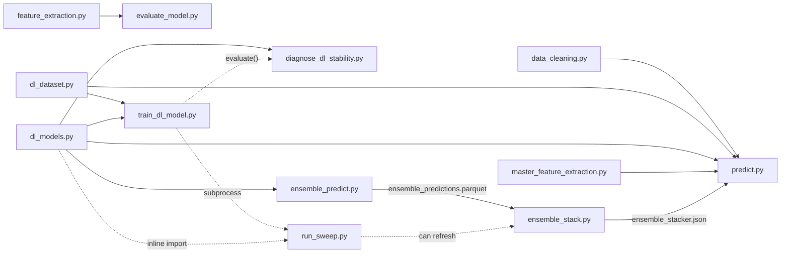
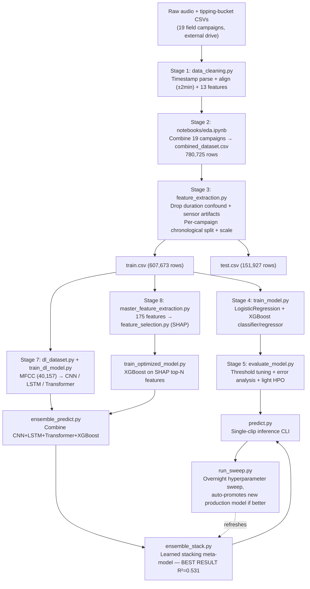
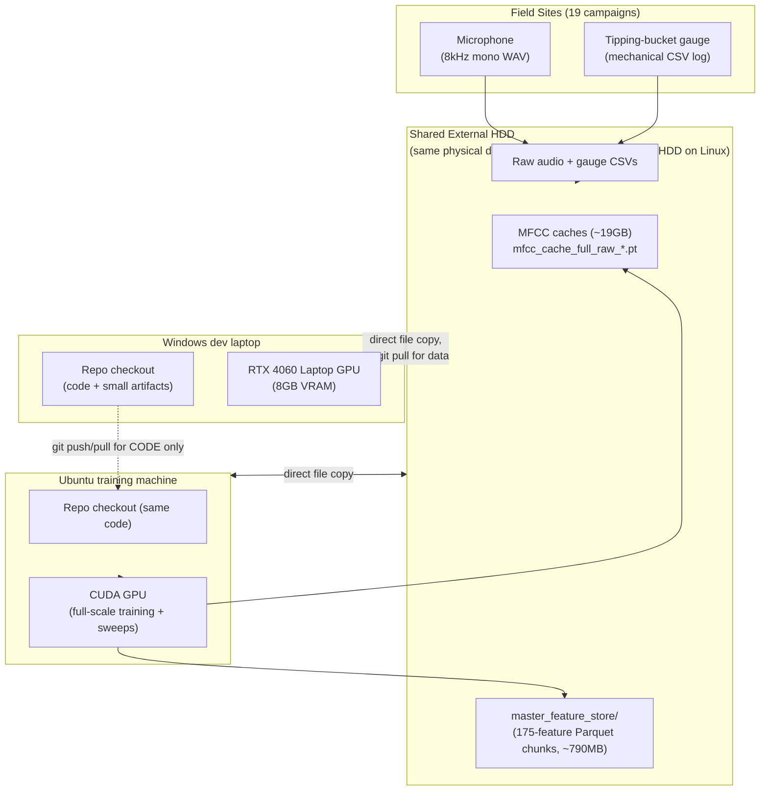
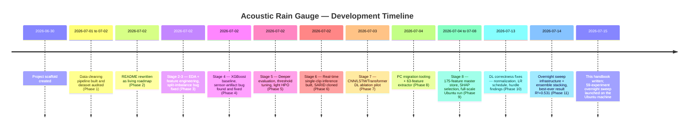

# The Acoustic Rain Gauge — Official Project Handbook

**Predicting rainfall from the sound of rain, using machine learning**

*A complete technical, historical, and research reference for the `acoustic_rain_gauge_ml` project. Written to be readable by a complete beginner, and precise enough to be useful to an engineer, researcher, or investor. Every fact in this document is grounded in the actual repository, its data, its results files, and its research library as they exist today — nothing here is invented or assumed.*

---

## How to read this document

This handbook has 19 numbered sections plus supporting appendices (glossary, reproducibility guide, gap analysis, FAQ). If you are non-technical, read Section 1 (Overview) and Section 18 (Conclusion) — they will make sense on their own. If you are an engineer picking up this codebase, start with Section 2 (Repository Analysis) and Section 9 (Training Pipeline). If you are a researcher, Section 12 (Research Papers) and the Gap Analysis will matter most to you. Every time a technical term appears for the first time in a section, it is explained in plain English before the technical definition.

---

# SECTION 1 — PROJECT OVERVIEW

## 1.1 Executive Summary

**Project name:** Acoustic Rain Gauge (repository: `acoustic_rain_gauge_ml`)

**In one sentence:** This project teaches a computer to listen to a 10-second audio clip and answer two questions — *is it raining right now?* and *if so, how much rain (in millimetres) is falling?* — using only the sound, with no camera and no direct contact with the rain.

**Where it stands today:** The project has processed **780,725 real audio clips** recorded over 19 separate field campaigns between December 2023 and June 2026, each clip time-matched to a genuine tipping-bucket rain gauge reading (the traditional mechanical instrument meteorologists trust). It has built a working "is it raining" detector with **88.7% discriminative accuracy (AUC-ROC)**, and a "how much rain" estimator that explains **53%** of the variation in rainfall intensity (R² = 0.531) using an ensemble of four different machine learning models working together. For comparison, the most relevant published research in this space (the SARID paper, discussed in depth in Section 12) reports R² = 0.765 on a smaller, more controlled dataset — so this project has a working system, a clear benchmark to compare against, and a clearly identified next lever to pull (adding wind-speed data) to close that gap.

## 1.2 Explained for a non-technical reader

Imagine you're standing outside during a storm. Even with your eyes closed, you can usually tell: is it raining or not? Is it a light drizzle or a heavy downpour? Your brain does this by listening to the *sound* — rain hitting leaves, roofs, and the ground makes a distinctive kind of noise, and the noise gets louder and changes character as the rain gets heavier.

This project builds a computer program that does the same thing, but rigorously and automatically. A microphone sits out in the field and records audio continuously. Right next to it sits a traditional mechanical rain gauge — a device with a little seesaw bucket that tips over and clicks every time a fixed, tiny amount of rain has fallen (this is literally how rainfall has been measured for over a century, and it is treated as "ground truth" — the correct answer we are trying to predict). Every 10-second audio clip gets paired up with what the mechanical gauge recorded at that same moment. Then a machine learning model — software that finds patterns in large amounts of example data rather than being explicitly programmed with rules — is shown hundreds of thousands of these (sound, actual-rainfall) pairs and learns, on its own, what rain sounds like at different intensities.

**Why would anyone want a rain gauge made of sound instead of a normal one?** Mechanical tipping-bucket gauges are precise, but they are also expensive to install everywhere, they can get clogged with debris, they freeze in winter, and a wind gust can make them under- or over-count. A microphone is cheap, has no moving parts to break or clog, and — if this project succeeds — could be added to infrastructure that already exists nearly everywhere, like street cameras, doorbell cameras, and phones, giving much denser rainfall coverage than we could ever afford with dedicated gauges.

## 1.3 Problem Statement

Rainfall varies enormously over small distances and short time windows, especially in cities (a storm cell can drench one street and miss the next one three blocks over) — but the existing tools for measuring it (tipping-bucket gauges, weather radar, satellites) cannot deliver dense, real-time, low-cost coverage at that scale. This project asks: **can ordinary ambient audio, captured by a cheap microphone, be used to both detect rainfall and estimate its intensity, accurately enough to be a practical low-cost sensor?**

## 1.4 Why This Project Was Created / The Real-World Problem

Accurate, fine-grained rainfall data drives flood warnings, urban drainage design, agricultural irrigation decisions, and climate research. Today's gold-standard instruments (tipping-bucket gauges, disdrometers that measure individual raindrop sizes) are accurate but sparse — a typical urban area might have only a handful of official gauges across dozens of square kilometres, because each installation is a piece of dedicated hardware that needs power, maintenance, and a fixed mounting location. Weather radar and satellites cover huge areas but at coarse resolution (kilometres, not streets) and with well-known accuracy problems in light rain or complex terrain. Audio sensing is attractive precisely because a microphone is inexpensive, solid-state (nothing to clog or freeze), and can piggyback on infrastructure that's already deployed for other purposes (security cameras, IoT nodes, smart city sensors).

## 1.5 Existing Solutions and Their Limitations

| Existing method | How it works | Limitations |
|---|---|---|
| Tipping-bucket rain gauge (used as this project's ground truth) | A small seesaw bucket tips and registers a "click" every time a fixed volume of rain (e.g. 0.2mm) has collected | Point measurement only (one location); undercounts in high wind (this is a well-documented literature finding, see Section 12.3); can clog with debris; mechanical parts wear out; expensive to deploy densely |
| Weather radar | Bounces radio waves off raindrops and infers intensity from the reflected signal | Kilometre-scale resolution, not street-scale; accuracy drops in light rain, near the ground, and in complex/urban terrain with radar beam blockage |
| Satellite rainfall estimation | Infers rainfall from cloud-top temperature/microwave signatures from orbit | Very coarse spatial/temporal resolution; poor at capturing short, intense, localized bursts |
| Disdrometers | Directly measure the size and speed of individual falling raindrops, usually optically or with a piezo/acoustic sensing plate | Precise but costly, and (like gauges) point measurements — very few are deployed compared to the area they'd need to cover |
| Video-based rainfall estimation (from surveillance cameras) | Analyzes rain streaks visible in video frames | Confounded by lighting changes, background clutter, and only works with visible rain streaks (fails at night without extra lighting, and in heavy rain streaks blur together) |
| Prior audio-based rainfall work (pre-SARID) | Classifies rainfall into coarse categories (light/moderate/heavy) from sound | Only ever attempted classification, not continuous intensity regression, until the SARID paper (2024) — see Section 12 |

## 1.6 Research Gap

Before SARID (2024), no open dataset or model existed for *continuous* rainfall-intensity regression from ambient audio — only coarse classification had been attempted. SARID closed part of that gap with a single-site, curated, rain-only dataset. This project's gap, relative to SARID, is: (1) working in *realistic, uncurated field conditions* across 19 different real recording campaigns with an 85%-dry/15%-rainy realistic class imbalance (SARID's dataset is 100% rain-only, curated), and (2) needing to solve *both* "is it raining" detection *and* intensity estimation together, since real deployments don't get told in advance which clips contain rain.

## 1.7 Innovation and Novelty

- A full, real-world, multi-year (Dec 2023 – Jun 2026), multi-campaign (19 separate field deployments) acoustic rainfall dataset — larger and messier, but more representative of real deployment conditions, than the existing published SARID dataset.
- A two-track modeling strategy: a classical hand-engineered-feature pipeline (175 acoustic features selected via SHAP — explained in Section 6) feeding XGBoost, run in parallel with a deep-learning pipeline (CNN/LSTM/Transformer reading the raw MFCC time-series, following SARID's architecture), and then a **learned stacking ensemble** that combines all of them — currently the single best-performing configuration in the project (R² = 0.531, nearly double any individual model's score).
- A resume-safe, failure-tolerant, unattended overnight hyperparameter-sweep infrastructure (`run_sweep.py`) that can run 59 experiments across three phases without supervision, automatically promoting a new production model only if it measurably beats the one already deployed.

## 1.8 Expected Outcome

A validated, reproducible pipeline that takes a raw 10-second WAV file and returns (a) a rain/no-rain classification with a documented, tunable confidence threshold, and (b) an estimated rainfall intensity in millimetres — plus a fully documented trail of every design decision, bug found and fixed, and metric measured along the way, so the work is auditable and extensible by someone who wasn't there when it was built.

## 1.9 Applications

- Smart-city infrastructure: adding rainfall sensing to existing security/traffic camera microphones without new hardware.
- Urban flood early-warning systems needing denser rainfall coverage than official gauge networks provide.
- Agricultural micro-climate monitoring (irrigation scheduling, crop-disease-risk modeling tied to leaf wetness/rainfall).
- Citizen-science and IoT rain-sensing networks (cheap, solid-state, low-maintenance nodes).
- Supplementing/cross-validating official gauge networks to catch instrument faults (a gauge reporting zero rain while its co-located microphone hears rain is a maintenance flag).

## 1.10 Industries Using Similar Systems

Meteorology and hydrology (rainfall networks, flood forecasting), smart-city/IoT infrastructure, agriculture technology (AgTech), insurance (parametric weather insurance needs dense, trusted rainfall data), and environmental/climate research.

## 1.11 Social and Commercial Value

**Social impact:** denser, cheaper rainfall monitoring directly improves flood early-warning lead time in exactly the underserved areas (dense urban informal settlements, rural agricultural zones) that official gauge networks tend to skip because of installation cost. **Commercial value:** every microphone-equipped device (security camera, smart doorbell, phone, IoT sensor node) is a potential rainfall sensor with zero additional hardware cost — a software-only upgrade path that is extremely attractive economically compared to installing and maintaining a new physical gauge network.

---

# SECTION 2 — COMPLETE REPOSITORY ANALYSIS

## 2.1 Folder Hierarchy and Purpose

```mermaid
flowchart TD
    ROOT["acoustic_rain_gauge_ml/ (repo root)"]
    ROOT --> SRC["src/ — all pipeline code (20 Python files)"]
    ROOT --> DATA["data/ — datasets (raw empty on purpose, processed has the real CSVs)"]
    ROOT --> MODELS["models/ — trained model files, scalers, ensemble artifacts"]
    ROOT --> DOCS["docs/ — metric reports (JSON), plots (PNG), running project log"]
    ROOT --> NOTEBOOKS["notebooks/ — eda.ipynb (Stage 2 EDA + dataset assembly)"]
    ROOT --> EXTREPOS["external_repos/ — cloned reference code (SARID, rainfall_monitor), gitignored"]
    ROOT --> TERMINAL["terminal/ — ad hoc scratch copies of docs/ JSON reports + a raw log"]
    ROOT --> ARGRES["ARG_Research/ — literature review workspace (400+ papers, tracker tool)"]
    ROOT --> PAPERMGR["paper_manager.py + friends — separate Streamlit literature-tracking tool"]
    ROOT --> MSME["msme/ — empty placeholder folder"]
    ROOT --> README["README.md, requirements.txt, .gitignore, migrate_to_hdd.ps1"]
```

**Why this structure exists:** the project follows a classic ML-project layout (code / data / models / docs separated) so that the large, private, or regeneratable artifacts (`data/`, `models/`, big caches) can be excluded from version control (`.gitignore`) while the code and small metric/report files stay tracked in git. Two folders — `ARG_Research/` and the root-level `paper_manager.py` family — are a **separate, unrelated tool** for managing the research-paper library that backs this project's design decisions; they are not part of the ML pipeline itself and do not import from or get imported by anything in `src/`.

## 2.2 `src/` — Every Pipeline File, In Full

The 20 files in `src/` form the entire ML pipeline. Each is listed with what it does, what it reads/writes, and — importantly — whether it's still the live, production code path, or a superseded/experimental/stub file kept for historical reasons.

| # | File | Status | Purpose (plain English first) |
|---|---|---|---|
| 1 | `data_cleaning.py` | **CURRENT — production** | Walks the 19 raw recording campaigns, matches each audio clip to the nearest tipping-bucket reading within 2 minutes, computes 13 basic acoustic features per clip, saves one cleaned CSV per campaign. This is the file that actually produced the real dataset (780,725 clips, ~4h22m run). |
| 2 | `data_cleaning_gpu.py` | Experimental, unused | A GPU-accelerated rewrite of #1 using `torchaudio` batched tensor ops instead of CPU multiprocessing. Never run on the full dataset and never cross-checked feature-for-feature against #1 — kept as a future-speed option, not currently trusted. |
| 3 | `analyze_dataset_v2.py` | One-off diagnostic (its job is done) | Scanned the raw drive once to answer "what's actually in this dataset" (file counts, durations, campaign structure) before the cleaning pipeline was designed. Its findings are now hardcoded into `data_cleaning.py`'s campaign list. |
| 4 | `dry_run_test.py` | Scratch / sanity check | A 50-file smoke test of the alignment+feature logic on one campaign, run once before committing to the multi-hour full run. |
| 5 | `feature_extraction.py` | **CURRENT — production (Stage 3)** | Takes the combined cleaned dataset and turns it into model-ready train/test splits: drops clips with confounded duration, drops sensor-glitch rainfall readings, splits chronologically **per campaign** (a bug-fix — a single global split badly skewed the rain rate between train and test), and scales the features. |
| 6 | `train_model.py` | **CURRENT — production (Stage 4)** | Trains the original baseline models: Logistic Regression, XGBoost classifier (rain/no-rain), XGBoost regressor (rainfall amount) — on the 13 hand-crafted features. This is the project's baseline every later result is measured against. |
| 7 | `evaluate_model.py` | **CURRENT — production (Stage 5)** | Digs deeper into the Stage 4 classifier: how well does it generalize per recording campaign, what confidence threshold gives the best precision/recall trade-off, what do the model's mistakes look like, and does a small hyperparameter search improve it. |
| 8 | `predict.py` | **CURRENT — production (Stage 6+)** | The single-clip inference command-line tool — feed it one WAV file, get a prediction back. It has grown over time to also support running the full ensemble (`--ensemble` flag) that combines all four model families. |
| 9 | `dl_dataset.py` | **CURRENT — production (Stage 7 infra)** | Loads raw audio and computes the MFCC (a compact numerical picture of a sound's frequency content over time — explained fully in Section 6) that the deep-learning models consume, with disk caching so this expensive step only happens once. |
| 10 | `dl_models.py` | **CURRENT — production (Stage 7 infra)** | Defines the three deep-learning model architectures (CNN, LSTM, Transformer), reimplemented from the SARID paper's written description because SARID's own published code doesn't actually run. |
| 11 | `train_dl_model.py` | **CURRENT — production (Stage 7)** | The training loop for the CNN/LSTM/Transformer models — supports a fast "pilot" mode (small subset) and a "full" mode (all 607,673 training clips), with early stopping and per-run tagging added later to support hyperparameter sweeps. |
| 12 | `advanced_feature_extraction.py` | **Superseded** | An earlier attempt at a richer 63-feature set. Explicitly replaced by file #13 — its own successor's docstring says "run this instead of, not alongside" #12. Kept in the repo as a historical record of the intermediate design. |
| 13 | `master_feature_extraction.py` | **CURRENT — production (Stage 8)** | The full 175-feature extractor (7 feature families — time-domain, spectral, MFCC, mel-bands, wavelets, rhythm, onset/tempo) that superseded #12. Produced the "master feature store" used by every model from Stage 8 onward. |
| 14 | `feature_selection.py` | **CURRENT — production (Stage 8)** | Uses SHAP (SHapley Additive exPlanations — a method for scoring how much each feature actually contributed to a model's predictions) to rank the 175 features and keep only the most useful top-N for the classifier and regressor separately. |
| 15 | `train_optimized_model.py` | **CURRENT — production (Stage 8)** | Retrains XGBoost on the SHAP-selected top features, and separately tests a "hurdle" two-stage design (classify first, then only estimate an amount for clips predicted rainy) — found the hurdle design actually performs *worse* than a single regressor. |
| 16 | `diagnose_dl_stability.py` | Experimental diagnostic | Investigates why the full-scale (607K-row) deep-learning training runs scored *worse* and were *less stable* than their own small-scale pilot runs. Its own finding was inconclusive/negative — an open problem, not a fix. |
| 17 | `ensemble_predict.py` | **CURRENT — production (ensembling, Stage "9")** | Runs CNN, LSTM, Transformer, and the optimized XGBoost models all on the same test set and evaluates ways of combining their predictions (simple average, weighted blend). |
| 18 | `ensemble_stack.py` | **CURRENT — production, best result in the project** | Goes one step further than #17: instead of a fixed blend, it *trains a small model* (a stacking meta-model) to learn the best way to combine the four base models' predictions. This produced the project's best-ever regression result, R² = 0.531. |
| 19 | `run_sweep.py` | **CURRENT — production, newest work** | An unattended overnight orchestrator that runs dozens of hyperparameter combinations across all three modeling stages automatically, saving every result as it goes and only replacing the deployed production model if a new configuration actually beats it. |
| 20 | `utils.py` | **Stub / dead code** | A single placeholder function with no body (`pass`). Never implemented, never imported anywhere. |

**Two root-level files that look like part of the ML pipeline but aren't:** `paper_manager.py` / `paper_manager_new.py` (empty) / `_write_pm.py` / `papers_database.csv` form a separate Streamlit app for tracking the research-paper library (see Section 2.4) — they share no code or data with `src/`.

## 2.3 `docs/`, `data/`, and `models/` — What's In Them

**`docs/`** holds every metrics report this project has ever produced (as JSON files, one per major experiment), several PNG plots (confusion matrix, feature importance, precision-recall curve), the running engineering log `PROGRESS.md`, a one-off dataset-scan report, a `NEW_PC_SETUP/` bundle of machine-migration guides (for moving the project between a Windows dev laptop and a Linux/GPU training box), and one raw captured terminal-output log (`transformer_2`, duplicated in `terminal/`).

**`data/processed/`** is the only populated part of `data/` — `data/raw/` and `data/external/` are deliberately kept empty in git (the real audio lives off-repo on an external drive). It contains `combined_dataset.csv` (780,725 rows, the Stage 2 output), and the modeling-ready `train.csv` (607,673 rows) / `test.csv` (151,927 rows) with a small `feature_engineering_metadata.json` recording exactly how the split was made.

**`models/`** holds every trained artifact this checkout has locally: the feature scaler, the Stage 4/5/8 XGBoost models, the three DL checkpoints (CNN/LSTM/Transformer), the ensemble's normalization stats, and the final stacking model (`ensemble_stacker.json` + its config). The multi-gigabyte MFCC training caches are **not** present in this local checkout — they live only on the external HDD used for full-scale training, confirming those large intermediate files are correctly excluded from the lighter development machine.

## 2.4 Other Folders (Briefly)

- **`ARG_Research/`** — a curated library of 400+ downloaded research papers on rain gauges, acoustic sensing, and rainfall measurement, plus a paper-tracking web page (`paper_tracker.html`) that matches PDFs to a master link list. This is the literature backbone referenced throughout Section 12, but it is a *human research workspace*, not code the pipeline runs.
- **`external_repos/`** — gitignored, locally-cloned reference repositories: `SARID/` (the paper this project's deep-learning architecture is based on) and `rainfall_monitor/` (another reference project). Kept for comparison/reading only.
- **`terminal/`** — a small scratch folder of manually-copied duplicate JSON reports and one raw terminal log; not referenced by any script.
- **`notebooks/eda.ipynb`** — the Stage 2 exploratory-analysis notebook that combines all 19 campaigns' cleaned CSVs into the single `combined_dataset.csv` that Stage 3 depends on.
- **`msme/`** — a completely empty folder; purpose unclear from the repository alone (likely a placeholder for future business/MSME-related material).

## 2.5 File Dependency Graph

**Reading this diagram:** solid arrows are direct Python imports (`from X import Y`); dashed arrows are looser couplings — `run_sweep.py` launches `train_dl_model.py` as a separate process rather than importing it, and it reads/writes the same files `ensemble_predict.py`/`ensemble_stack.py` do rather than calling their functions directly. The two most-reused modules are `dl_models.py` (the model architecture definitions, needed by five different files) and `dl_dataset.py`/`data_cleaning.py`/`master_feature_extraction.py` (the three "sources of truth" for how to turn raw audio into features — `predict.py` deliberately imports from all three rather than reimplementing feature math a fourth time, which would risk it silently drifting out of sync with training).

---

# SECTION 3 — PROJECT HISTORY

## 3.1 The Full Development Timeline

Every one of the 20 commits in this repository's history was made on a single unbranched `main` line between **2026-06-30 and 2026-07-14** — a linear, two-week-long build. The table below groups them into 11 natural phases, each triggered by something the previous phase discovered.

| Phase | Date(s) | What happened | Why |
|---|---|---|---|
| 0. Scaffold | 06-30 | Project skeleton created: folder layout, `requirements.txt`, four empty stub modules | Establish the intended shape (clean → extract → train) before writing real code |
| 1. Data cleaning + auditing | 07-01 – 07-02 | Real Stage-1 cleaning pipeline written; a GPU variant added; two dataset-scanning scripts written, the buggy first one (which wrongly reported 0 audio files due to a non-recursive search) deleted once the fixed version confirmed the real count | Before any feature engineering, the team needed to know exactly what the raw dataset actually contained |
| 2. README as living doc | 07-02 | README rewritten from a bare file list into a full project reference with architecture diagram and roadmap | Establishes a pattern used for the rest of the project: a "docs: sync README" commit after almost every stage |
| 3. Stages 2–3: EDA + splits | 07-02 | Notebook combines all 19 campaigns into one dataset; feature-engineering script filters and splits it | EDA found a "duration confound" (short clips have a totally different acoustic profile and near-zero rain rate) and a severe train/test rain-rate imbalance from using one global time cutoff — both fixed in the same phase |
| 4. Stage 4: XGBoost baseline | 07-02 | Logistic Regression + XGBoost classifier/regressor trained | Running the regressor against real data immediately surfaced a serious bug — see 3.2 below |
| 5. Stage 5: deeper evaluation | 07-02 | Per-campaign breakdown, threshold tuning, error analysis, light hyperparameter search | The aggregate 46% precision from Stage 4 turned out to be mostly a fixable "operating point" choice, not a fundamental model weakness |
| 6. Stage 6: real-time inference | 07-02 | Single-clip prediction CLI (`predict.py`) built; SARID reference repo cloned for the next stage | Needed a way to actually *use* the trained model on a new recording, and had decided the next stage would need a research precedent for deep learning on raw MFCC |
| 7. Stage 7: deep learning ablation | 07-03 | CNN/LSTM/Transformer models built and pilot-trained on raw MFCC time-series | The Stage-4 regressor fed the model only the *average* MFCC values, discarding all timing information — the hypothesis was that keeping the full time series would help, and the pilot confirmed it (up to 2.24× the baseline R²) |
| 8. Infrastructure interlude | 07-04 | Machine-migration tooling and a 63-feature "advanced" extractor added | Preparing to move the compute-heavy parts of the project onto a more capable Linux/GPU machine |
| 9. Stage 8: master feature store | 07-04 – 07-08 | 175-feature extractor built, SHAP-based feature selection added, full-scale extraction run (4.34 hours on the new Ubuntu machine), per-batch crash-resilience checkpointing added | The 63-feature extractor was superseded by a richer, resume-safe 175-feature design; a real interruption (an HDD got unplugged mid-run) proved the need for the checkpointing fix, added the same day it was needed |
| 10. DL correctness fixes | 07-13 | Removed a normalization step that was erasing loudness information the SHAP ranking had shown mattered; added a learning-rate schedule; documented that a two-stage "hurdle" model underperforms a single regressor | Full-scale training was producing unstable, sometimes-declining results across epochs despite smoothly falling training loss — a classic sign the learning rate was too large for the much larger number of training steps at full scale |
| 11. Overnight sweep + ensembling | 07-14 | Early stopping added; a 3-phase, 59-experiment unattended sweep orchestrator built; the ensemble/stacking pipeline (combining all four model families) added, producing the project's best-ever result | Manually tuning dozens of hyperparameter combinations one at a time doesn't scale — an automated, resumable, failure-tolerant sweep was needed to use overnight compute time productively |

## 3.2 Notable Bugs Found and Fixed (in chronological order)

1. **The "0 audio files" bug (Phase 1):** the first dataset-scanning script used a non-recursive file search and reported zero audio files across the entire dataset. Fixed by writing a recursive version; the buggy script and its misleading report were deleted rather than left around to confuse a future reader.
2. **The train/test rain-rate mismatch (Phase 3):** splitting the dataset with one single global "everything before this date is train, everything after is test" cutoff produced wildly different rain rates in each half (8.9% rainy in train vs. 39.4% in test), because the 19 recording campaigns span 2.5 uneven years and some months were much rainier than others. Fixed by splitting **within each campaign separately** (last 20% of each campaign's data becomes that campaign's test portion), which brought the two halves back into balance (15.1% vs 14.6%).
3. **The sensor-artifact rainfall bug (Phase 4):** the very first regressor scored an R² of **-0.045** — worse than simply guessing the average rainfall for every clip. Investigation found 204 rows carrying a repeating, physically implausible ~655mm rainfall reading (real readings never exceed 21.6mm) scattered across unrelated recording campaigns — almost certainly a mechanical counter that overflowed and wrapped around. Dropping/capping these rows fixed the regressor immediately (R² jumped to 0.155).
4. **The MFCC crash-resilience gap (Phase 9):** the first attempt to precompute MFCC features for the full 607,000+ row training set only saved its progress once, at the very end — and it was interrupted partway through (an external drive got unplugged), losing hours of computation. Fixed the same day by writing each batch to disk immediately as it completes.
5. **The full-scale DL instability finding (Phase 10-11):** full-scale training (607K rows) performed *worse* than the same architecture's small 40K-row pilot run, and its test-set R² bounced up and down between epochs instead of climbing smoothly — even though the training loss was falling normally. This pointed to the learning rate being tuned for the pilot's much smaller number of optimizer steps and being too large once the dataset (and therefore the number of training steps per epoch) grew ~15×. A cosine learning-rate schedule was added, and a dedicated diagnostic script was written to test the hypothesis directly — its result was suggestive (a lower learning rate/larger batch size showed measurably lower epoch-to-epoch variance) but not a complete fix; this remains a genuinely open problem, documented honestly rather than papered over (see Section 11).
6. **The "silent normalization" bug (Phase 10):** an earlier version of the MFCC extractor divided every clip by its own peak volume before feeding it to the deep-learning models. This seemed reasonable, but the SHAP feature-importance analysis from the classical pipeline had already shown that *absolute* loudness (not loudness relative to the clip's own peak) was one of the strongest rainfall predictors — meaning the per-clip normalization was throwing away exactly the information that mattered most. Fixed by switching to normalization using statistics computed once, globally, across the whole training set.

---

# SECTION 4 — DATASET ANALYSIS

## 4.1 Source and Collection

**Who collected it:** field recordings gathered by the project's own author across **19 separate recording campaigns** running from December 2023 through June 2026 — this is original, purpose-collected field data, not a public dataset. Each campaign pairs a folder of raw audio recordings with a folder (or, in most campaigns, a separate stream) of readings from a mechanical tipping-bucket rain gauge deployed at the same site.

**Collection method:** a microphone recorded continuously in the field; a co-located tipping-bucket gauge logged rainfall readings with its own timestamps. The two data streams are not natively synchronized — matching them up is the first real engineering problem this project solves (see Section 5).

**License / access:** this is private, original field data (not a licensed public dataset); it is deliberately excluded from version control (`data/raw/` is empty in git) and lives only on external drives.

## 4.2 Size, Format, and Structure

| Property | Value |
|---|---|
| Total audio clips | 780,725 (confirmed by two independent counts — a recursive file scan and the row count of the fully cleaned dataset) |
| Format | `.wav`, mono, **8,000 Hz sample rate** |
| Clip duration | Predominantly **exactly 10.0 seconds** (80,000 samples); a small minority of clips from two early campaigns run shorter — see 4.4 |
| Recording span | December 2023 → June 2026 (roughly 2.5 years) |
| Number of campaigns | 19, each a separate real-world deployment window |
| Clips matched to a gauge reading (within 2 minutes) | 699,145 of 780,725 |
| Rainy vs. dry (whole dataset, before any filtering) | 114,415 rainy (14.7%) / 666,310 dry (85.3%) |

## 4.3 Folder Organization

Each campaign follows one of two naming conventions found in the raw data: an older style where audio and the mechanical-gauge CSV sit in one combined folder (e.g. `January_2024_rainfall_audios_with_mech_data`), and a newer style where they're split into two separate folders (e.g. `August_2025_Rain_Data` + `August_2025_mechanical_rainfall_data`). Audio files are further organized into daily sub-folders within each campaign (e.g. `2024_04_11`). The cleaning pipeline (`src/data_cleaning.py`) hardcodes the mapping between all 19 audio-folder/gauge-folder pairs, since the naming isn't fully consistent across campaigns.

## 4.4 Known Data-Quality Challenges

- **The duration confound:** two early campaigns (January 2024 entirely, and part of December 2023) recorded clips shorter than 5 seconds instead of the standard 10-15 second window — and these short clips happen to have a very different acoustic profile and an almost-zero rain rate. Left uncorrected, a model could learn to key off clip *length* rather than the actual sound of rain. These clips (2.7% of the dataset, 20,921 rows) are dropped before modeling.
- **The sensor-artifact readings:** 204 rows across several unrelated campaigns recorded a repeating, physically-impossible ~655mm rainfall value — almost certainly a mechanical gauge counter overflow/wraparound. These are capped/dropped (see Section 3.2, bug #3).
- **Severe class imbalance:** only ~15% of clips are rainy in both the training and test sets. This is realistic (it reflects how often it actually rains) but means a lazy model that always predicts "dry" would already be "correct" 85% of the time — accuracy alone is a misleading metric here, which is why this project reports AUC-ROC, precision, and recall instead (explained in Section 10).
- **Uneven rain rates between campaigns:** some campaigns are almost entirely dry (a handful of near-zero-rain months where evaluation metrics like precision/recall become statistically unstable simply because there are so few positive examples to measure against) while others (e.g. Feb–Mar 2026) are over 90% rainy. This is why the train/test split is done *per campaign* rather than as one global split (Section 3.2, bug #2).
- **Wind is not recorded.** No wind-speed measurement exists anywhere in this dataset. As Section 12 discusses in depth, this is very likely the single largest source of unexplained error in both the rainfall labels themselves (wind biases tipping-bucket gauges) and the audio (wind noise can mask or mimic rain sounds).

## 4.5 Advantages and Disadvantages of This Dataset

**Advantages:** genuinely large (780,725 clips — far larger than any published comparable dataset, including SARID's 12,066 slices); spans 2.5 years and 19 independent deployments, so it captures real seasonal and site-to-site variation rather than one controlled setting; ground-truth comes from an actual mechanical instrument, not a human label.

**Disadvantages:** realistic-but-messy class imbalance makes both training and evaluation harder than a curated, balanced dataset would be; no environmental covariates (wind, temperature, humidity) were recorded alongside the audio, which the research literature (Section 12) strongly suggests limits achievable accuracy; two known data-quality artifacts (duration confound, sensor-counter glitch) had to be found and removed by hand rather than being clean from the start — a reminder that real field data always needs auditing before it can be trusted.

---

# SECTION 5 — DATA CLEANING

Every step below runs inside `src/data_cleaning.py` (Stage 1) and `src/feature_extraction.py` (Stage 3). For each step: what it is in plain English, why it's needed, what breaks without it, and its measured before/after impact.

## 5.1 Timestamp Parsing

**Plain English:** every audio filename has the recording's date and time buried in it (e.g. `20240501_143022.wav`); this step reads that out of the filename using pattern matching.

**Technical:** two regular-expression patterns are tried against each filename (`\d{4}[_-]\d{2}[_-]\d{2}[_-]\d{2}[_-]\d{2}[_-]\d{2}` and `\d{4}\d{2}\d{2}[_-]\d{2}\d{2}\d{2}`), covering the two naming conventions found across the 19 campaigns.

**Why it's necessary:** without a timestamp, an audio clip cannot be matched to a rain-gauge reading at all — this is the single foundational step the entire dataset depends on.

**What happens without it:** the entire alignment step (5.2) becomes impossible; there would be no way to know what the weather was doing when a given clip was recorded.

## 5.2 Time Alignment / Synchronization

**Plain English:** the microphone and the rain gauge are two separate devices with two separate clocks, recording independently. This step finds, for every audio clip, the closest-in-time gauge reading and pairs them up — but only if they're close enough together to trust the match.

**Technical:** implemented with `pandas.merge_asof(audio_df, mech_df, direction='nearest', tolerance=pd.Timedelta(minutes=2))` — a nearest-neighbor join on the timestamp column. Clips with no gauge reading within a 2-minute window get `rainfall_mm` filled to 0.0 and are flagged `is_aligned=False` (treated as dry by default rather than discarded).

**Why 2 minutes:** rain gauges and audio recorders in the field don't share a clock sync mechanism; some drift is expected. Two minutes is a deliberate compromise — tight enough that "what the gauge measured" is still a fair description of "what was happening during this clip," loose enough that clock drift doesn't throw away large amounts of otherwise-good data.

**Impact without it:** a naive exact-timestamp join would discard almost the entire dataset, since real-world clocks are never perfectly synchronized to the second.

## 5.3 Duration Filtering (removing the "duration confound")

**Plain English:** two early recording campaigns accidentally captured much shorter clips (under 5 seconds) than the rest of the dataset (10-15 seconds) — and it turns out short clips sound acoustically different for reasons that have nothing to do with rain, and almost never contain rain at all. Keeping them in would let the model cheat by learning "short clip = dry" instead of learning what rain actually sounds like.

**Before:** 780,725 clips, including 20,921 in the `<5s`/`5-10s` duration bins with a measured spectral centroid (a rough loudness/brightness measure — Section 6) of ~1,160 Hz and a rain rate of just 2.0%, versus ~478 Hz and 15.0% rain rate for the standard-duration clips.

**After:** 759,804 clips remain, all in the `10-15s` duration bin, so no shortcut based on clip length is available to the model.

**Impact on model:** this fix was made *before* any model was trained on the full dataset, as a preventive measure identified during EDA (Stage 2) rather than discovered as a live bug — a good example of catching a subtle bias before it contaminates results rather than after.

## 5.4 Sensor-Artifact / Outlier Removal

**Plain English:** the mechanical rain gauge's own internal counter appears to have glitched and wrapped around at some point, producing 204 rows with a rainfall reading of about 655mm — a physically absurd number given that legitimate readings in this dataset never exceed 21.6mm.

**Why it matters so much:** this single issue was severe enough to make the very first regression model score *worse than doing nothing* (R² = -0.045; see Section 3.2, bug #3). A model trying to fit these 655mm outliers alongside legitimate 0-20mm readings gets its error metric dominated by a handful of nonsensical numbers.

**Fix:** `drop_sensor_artifact_readings()` caps `rainfall_mm` at 50.0 and removes/corrects rows above that threshold. **After:** R² recovered from -0.045 to 0.155, RMSE fell from 7.88 to 0.34, MAE fell from 0.41 to 0.11 — by far the single largest one-line-of-code improvement anywhere in this project's history.

## 5.5 Chronological, Per-Campaign Train/Test Split

**Plain English:** rather than picking one single date and saying "everything before this is training data, everything after is test data," each of the 19 campaigns is split *individually* — the earliest 80% of each campaign's clips become training data, the last 20% become test data.

**Why not a single global cutoff:** a single global date cutoff was tried first and produced a severely mismatched rain rate between train (8.9% rainy) and test (39.4% rainy), because the 19 campaigns span 2.5 uneven years and some months are much rainier than others — a model trained mostly on dry conditions and tested mostly on wet ones is being evaluated unfairly, and its measured accuracy would say more about the split than about the model.

**After the fix:** train is 15.08% rainy, test is 14.57% rainy — comparable, real-world-representative proportions in both halves.

**Why chronological within each campaign specifically (not a random shuffle):** predicting from a clip that's later in time than everything the model saw during training is a much more honest test of "does this model generalize to a real deployment" than a random shuffle, which would let the model "cheat" by learning from clips just minutes away in time from ones it's being tested on.

## 5.6 Class Weighting and Feature Scaling

**Plain English:** since rainy clips are much rarer (~15%) than dry ones, the models are told to pay extra attention to rainy examples during training so they don't just learn to always guess "dry." Separately, all the numeric features are rescaled onto a common, comparable range.

**Technical:** class weights of `{0 (dry): 0.589, 1 (rainy): 3.315}` are computed from the training data only (inverse to class frequency), and a `StandardScaler` (rescales each feature to have mean 0 and standard deviation 1) is fit on training data only and then applied to both train and test — fitting only on training data prevents "peeking" at the test set's statistics, a subtle form of data leakage that would make test performance look artificially better than it would be in a real deployment.

## 5.7 Data Validation and Resume-Safety

Every extraction script in this project (`data_cleaning.py`, `master_feature_extraction.py`, the MFCC precompute step) is built to be resumable: it checks whether a campaign/chunk/batch has already been processed and skips it if so, and writes its progress to disk incrementally rather than only at the very end. This was not a theoretical concern — it directly prevented data loss during a real interruption (an external drive being unplugged mid-run during the Stage 8 full-scale extraction; see Section 3.2, bug #4).

---

# SECTION 6 — FEATURE ENGINEERING

A **feature** is simply a single number computed from a clip that summarizes something about it — the raw audio waveform itself (80,000 numbers for a 10-second, 8kHz clip) is too unwieldy and unstructured for classical machine learning models to use directly, so features compress it into a smaller set of meaningful numbers. This project uses two feature sets at different stages: a 13-feature set (Stages 1-4) and a 175-feature set (Stage 8), plus the raw MFCC time-series fed directly to the deep-learning models (Stage 7).

## 6.1 The Original 13 Scalar Features (Stage 1-4)

| Feature | Full name / definition | Real-life meaning | Relation to rain |
|---|---|---|---|
| `rms` | Root Mean Square energy — the square root of the average squared amplitude of the waveform | Overall loudness of the clip | Rain adds a constant, textured loudness; louder clips are more likely to be rainy |
| `peak` | The single largest absolute sample value in the clip | The loudest single instant in the clip | Distinguishes a sudden loud event (a car horn) from sustained rain noise |
| `par` | Peak-to-Average Ratio — `peak / rms` | How "spiky" versus how "steady" a sound is | Rain tends to be steadier (lower PAR) than sudden discrete non-rain sounds |
| `spectral_centroid` | The "center of mass" of the frequency spectrum — a weighted average of frequency, weighted by how much energy is at each frequency | Perceived brightness/pitch of a sound | Rain has a characteristic frequency signature distinct from wind, traffic, or voices |
| `spectral_bandwidth` | How spread out the frequency content is around the centroid | Whether a sound is "thin" (narrow band) or "full" (wide band) | Heavier rain tends to spread energy across more frequencies |
| `spectral_rolloff` | The frequency below which a fixed percentage (commonly 85%) of the total spectral energy is contained | Where the "top" of the sound's meaningful frequency content is | Useful for telling rain apart from loud, high-frequency non-rain sounds (this project's error analysis found elevated `spectral_rolloff` values in false-positive mistakes — see Section 10) |
| `zero_crossing_rate` | How often the waveform crosses zero (changes from positive to negative) per unit time | A rough proxy for "noisiness" versus "tonal-ness" of a sound | Rain (a broadband noise-like signal) tends to have a higher zero-crossing rate than tonal sounds like speech or music |
| `energy_variance` | The variance of energy computed over short (50 millisecond) frames within the clip | How consistent or fluctuating the loudness is *within* the clip | Steady rain has low energy variance; intermittent sounds (footsteps, talking) have high variance |
| `mfcc_0` – `mfcc_4` | Mel-Frequency Cepstral Coefficients (means of the first 5 coefficients) — see 6.3 for full explanation | A compact numerical "fingerprint" of the overall timbre/texture of the sound | `mfcc_2` was found to be the single most important feature for the Stage 4 rain classifier |

## 6.2 The 175-Feature Master Store (Stage 8)

Built by `master_feature_extraction.py`, this is a much richer feature set across seven families, extracted per clip:

| Family | Count | What it captures |
|---|---|---|
| Time-domain + Teager Energy Operator | 11 | Basic loudness/shape statistics (RMS, peak, crest factor, skewness, kurtosis, zero-crossing rate, total energy) plus the Teager Energy Operator — a formula (`ψ(x[n]) = x[n]² − x[n−1]·x[n+1]`) that's especially sensitive to sudden amplitude *and* frequency changes together, useful for catching abrupt onset/impact-like sounds (like individual raindrops) that plain energy measures miss |
| Spectral, including flux | 10 | Centroid, bandwidth, two rolloff percentiles (85%/95%), flatness (how "noise-like" versus "tonal" the spectrum is), spectral contrast (difference between spectral peaks and valleys), and spectral flux (how much the spectrum *changes* from one moment to the next — rain's frequency content fluctuates in a specific way as individual drops strike) |
| MFCC (mean + standard deviation of 13 coefficients) | 26 | The same timbre "fingerprint" concept as the 13-feature set, but with 13 coefficients instead of 5, and capturing both the *average* value and how much it *varies* across the clip |
| Dense mel-band statistics (40 bands × mean + std) | 80 | A full 40-band breakdown of energy across the audible-for-8kHz frequency range (see Section 7 for what a "mel band" is), rather than the compressed, decorrelated MFCC summary — the single largest feature family, and (per the SHAP rankings below) the most important one for both tasks |
| Wavelet decomposition | 15 | Breaks the signal into different frequency bands *and* keeps timing information at each band simultaneously (something a plain FFT-based spectrum discards) — 5 decomposition levels × 3 statistics (energy ratio, entropy, variance) |
| Histogram-packet rhythm | 28 | Splits the clip into 0.5-second windows and builds a histogram of RMS and zero-crossing-rate values across those windows, plus summary statistics — captures the *rhythm* of a sound (is it steady, or does it come in bursts?) rather than just its average character |
| Onset/tempo | 5 | Estimated tempo (beats per minute — repurposed here to describe the "drumming" rate of rain impacts rather than musical tempo), onset strength (how sharply new sound events begin), attack/decay rate |

**Feature-count note (an honest inconsistency in the project's own documentation):** the extraction script's code comments and the README/PROGRESS.md alternately describe this as a "175-feature" and "176-feature" store. Counting the seven families above (11+10+26+80+15+28+5) sums to exactly **175** — this handbook uses 175 as the correct count, and flags the 176 figure elsewhere in the project as a minor documentation inconsistency (see Section 15).

## 6.3 What Is an MFCC, Really? (Full Explanation)

**Plain English first:** imagine describing a person's voice not by replaying the actual sound, but by describing its *texture* — "deep and gravelly," "high and thin," "resonant." An MFCC does something similar for any sound: it's a small set of numbers (this project uses 13, or sometimes just 5) that compactly capture the overall "texture" or "timbre" of a sound at a given instant, in a way that closely matches how the human ear actually perceives pitch and loudness differences.

**Technical:** to compute an MFCC, a short window of audio (see Section 7 for framing/windowing) is converted to a frequency spectrum via the Fast Fourier Transform, that spectrum is passed through a bank of triangular filters spaced according to the **mel scale** (a frequency scale that matches human pitch perception — equal steps in mel-scale correspond to equal perceived pitch jumps, unlike raw Hertz, where the ear is much more sensitive to small changes at low frequencies than at high ones), the log of each filter's output energy is taken, and finally a Discrete Cosine Transform compresses that log-mel-spectrum into a small number of decorrelated coefficients — the MFCCs. In this project, MFCCs are used two ways: as simple **scalar summaries** (the mean, or mean+std, of each coefficient across the whole clip — used by the classical XGBoost pipeline) and as a **full time-series** (a `(40, 157)`-shaped matrix — 40 mel-frequency-ish channels by ~157 time steps — fed directly into the CNN/LSTM/Transformer models, preserving exactly how the sound changes moment-to-moment across the clip, which the scalar summary throws away).

**Why MFCC was chosen over Mel-spectrogram or STFT (raw spectrogram):** this project follows the finding from the SARID paper (Section 12), which directly compared all three feature types across all three deep-learning architectures and found MFCC won by 16-21% on every metric, on top of also being far cheaper to store (a full Mel-spectrogram cache for this project's dataset would require an estimated 61GB versus MFCC's 19GB, a real practical constraint given the available disk space).

## 6.4 Feature Importance — What Actually Matters, According to the Data

Rather than guessing which features matter, this project used **SHAP** (SHapley Additive exPlanations) — a method, based on game theory, for fairly attributing how much each individual feature contributed to a specific prediction, then averaging that across many predictions to rank features overall. Two independent rankings were computed (one for the classifier, one for the regressor), because an early attempt to reuse one ranking for both tasks measurably *hurt* the classifier (AUC 0.842 vs. 0.883 baseline) — rainfall *amount* and rainfall *occurrence* are not always predicted by the same features.

- **Top features for detecting rain (classifier):** dominated by dense mel-band means (bands 27, 36, 2, 18, 6...), plus `mfcc_3_mean` and `fd_spectral_contrast_mean`.
- **Top features for estimating rainfall amount (regressor):** also mel-band-dominated, but a different subset (bands 8, 7, 0, 37, 6...), plus wavelet variance, spectral flux, and `td_peak`/`td_rms`/`td_energy` — meaning **absolute loudness matters a lot for estimating how much it's raining**, which directly motivated removing the per-clip volume normalization from the deep-learning pipeline (Section 3.2, bug #6).

## 6.5 Features Considered and Rejected

The 63-feature "advanced" set (`advanced_feature_extraction.py`) — an intermediate design between the 13-feature and 175-feature sets — was tried and explicitly superseded once the richer 175-feature master store was built; it is kept in the repository as a historical record but is not used by any current model.

---

# SECTION 7 — SIGNAL PROCESSING

## 7.1 Sampling Rate and the Nyquist Limit

**Plain English:** a microphone doesn't record a truly continuous sound wave — it takes rapid snapshots ("samples") of the air pressure many times per second. **8,000 Hz** (confirmed for every clip in this dataset) means 8,000 snapshots are taken every second.

**Why this matters (the Nyquist theorem):** a sampling rate can only faithfully capture frequencies up to *half* the sampling rate — for an 8,000 Hz recording, that's a ceiling of **4,000 Hz**. Any real sound content above 4,000 Hz would either be lost or, worse, "fold back" and masquerade as a lower, wrong frequency (a distortion called **aliasing**). This is a real, deliberate constraint in this project: one of the 175 features (`spectral_contrast`) had its number of frequency bands explicitly capped during development specifically to respect this 8kHz Nyquist ceiling, and using the native 8kHz rate (instead of artificially upsampling to 16kHz, which was considered and rejected) avoids wasting computation on frequency detail that was never actually captured by the microphone in the first place.

## 7.2 Framing, Windowing, and Hop Length

**Plain English:** you can't meaningfully ask "what frequency is this sound?" for an instant of time — frequency is a property of a *stretch* of time. So instead of analyzing the whole 10-second clip in one shot (which would blur together everything that happened during those 10 seconds), the audio is chopped into many small overlapping chunks called **frames**, each analyzed separately, one after another, to build up a picture of how the sound changes over time.

**Technical:** each frame is multiplied by a smooth **window function** before analysis, which tapers the frame's edges toward zero — without this, the abrupt cut at each frame's boundary would introduce fake, spurious frequency content into the analysis (an artifact of chopping a signal abruptly, unrelated to anything actually in the sound). The **hop length** is how far the analysis window slides forward between frames; a hop length shorter than the frame length means frames overlap, giving a smoother, more detailed picture of how the sound evolves. This is exactly the mechanism that produces the MFCC's `(40, 157)` time-series shape described in Section 6.3 — 157 is the number of overlapping analysis frames that fit across one 10-second, 8kHz clip at this project's chosen frame/hop settings.

## 7.3 The Fast Fourier Transform (FFT) and Spectrograms

**Plain English:** the FFT is the mathematical tool that answers "how much of each frequency is present in this chunk of sound?" — it takes a frame of raw waveform (a list of amplitude numbers over time) and converts it into a list of frequency-strength numbers (how loud each pitch/frequency is at that moment). Stacking the FFT result from every frame side-by-side, in time order, produces a **spectrogram** — a picture where one axis is time, the other is frequency, and brightness/color shows loudness at that time-frequency combination. This is literally the object being computed, frame by frame, on the way to producing an MFCC or a mel-spectrogram feature.

## 7.4 Noise and Aliasing Considerations

The project's audio is field-recorded, so genuine environmental noise (wind, traffic, human activity, insects) is mixed in with any rain sound by nature — this is not filtered out with a dedicated noise-suppression step anywhere in the current pipeline; instead, the machine learning models are trained directly on the noisy real-world audio and learn to distinguish rain's acoustic signature from this background noise statistically. The project's own error analysis (Section 10) shows this isn't perfect: the model's false-positive mistakes (things it wrongly calls "rainy") disproportionately have the acoustic signature of *loud* non-rain sounds, suggesting that today's models are essentially detecting "is this clip loud and broadband," which rain usually — but not always — is.

---

# SECTION 8 — MODEL DEVELOPMENT

## 8.1 Logistic Regression (Stage 4 baseline)

**What it is (plain English):** the simplest possible classifier — it learns a single "score" as a straight-line-weighted combination of the input features, then squashes that score into a probability between 0 and 1.
**Why chosen:** as a sanity-check floor — if a fancier model can't beat this, the fancier model isn't earning its complexity.
**Result:** AUC-ROC 0.660 — clearly weaker than XGBoost, confirming the rain-detection problem needs a model that can capture non-linear feature interactions.

## 8.2 XGBoost (classifier and regressor — the classical-ML backbone of this project)

**What it is (plain English):** XGBoost builds hundreds of small decision trees one after another, where each new tree focuses specifically on fixing the mistakes the trees before it made — the trees vote together for a final answer. ("Gradient boosting" is the technical name for this "learn from the previous mistakes" training process; XGBoost is a specific, highly optimized, widely-used implementation of it.)
**Why chosen:** it handles tabular, hand-engineered features (like this project's 13 or 175 scalar features per clip) extremely well, trains fast even on hundreds of thousands of rows, and — unlike a neural network — comes with built-in, well-understood feature-importance tooling (which is what SHAP, Section 6.4, is built on top of).
**Two separate models are trained:** a **classifier** (is it raining? — outputs a probability) and a **regressor** (how much rain, in mm? — outputs a number), because these are genuinely different prediction tasks, not the same model doing two things.
**Hyperparameters that mattered:** `scale_pos_weight` (balances the rare rainy class, similar in spirit to the class weighting in Section 5.6); the Stage 5 tuning search found `max_depth=8, n_estimators=500, learning_rate=0.03, min_child_weight=5` improved AUC from 0.883 to 0.893 on the original 13-feature set.
**Advantages:** fast, interpretable (via SHAP), doesn't need GPU hardware, robust to unscaled/mixed features.
**Disadvantages:** cannot natively see the *time series* structure within a clip — it only ever sees single summary numbers per feature per clip, discarding exactly the moment-to-moment detail the deep-learning models (8.3) were built to capture instead.

## 8.3 Deep Learning: CNN, LSTM, and Transformer (Stage 7)

All three architectures take the full `(40, 157)` MFCC time-series (Section 6.3) as input and output a single number: estimated `rainfall_mm`. They were reimplemented from the SARID paper's written architecture description rather than importing SARID's own published code, because that code contains unfilled template placeholders and shape bugs that don't actually run.

| Architecture | What it is (plain English) | This project's specific design |
|---|---|---|
| **CNN** (Convolutional Neural Network) | Slides small pattern-detecting filters across the MFCC "image," building up from simple local patterns (like a short burst of energy in one frequency band) to more complex ones, the same basic idea used for recognizing objects in photographs | 3 convolution+batch-normalization+ReLU-activation blocks, pooling and dropout for regularization, a global-average-pool step, then 2 fully-connected layers to the final number |
| **LSTM** (Long Short-Term Memory network) | A type of recurrent neural network that reads the MFCC time-series one time-step at a time, left to right, carrying forward a "memory" of what it's seen so far — good at picking up on patterns that unfold gradually over the whole clip | 2 stacked LSTM layers, 256 hidden units, the network's final hidden state fed into a fully-connected output layer |
| **Transformer** (encoder-only) | Instead of reading strictly left-to-right like the LSTM, a Transformer lets every time-step "attend to" (weigh the relevance of) every other time-step directly, all at once — the current best-performing architecture in both this project's pilot run and the SARID paper it's based on | 4 Transformer encoder layers, 4 attention heads, mean-pooling across time before the final fully-connected output layer |

**Loss function:** `SmoothL1Loss` (a hybrid between squared error and absolute error — behaves like squared error for small mistakes but doesn't let a few extreme outliers dominate training the way plain squared error would; a sensible choice given this project's own history of rainfall-label outliers, Section 5.4).
**Optimizer:** Adam, with a cosine-annealing learning-rate schedule added later (Section 3.2, bug #5) to stabilize full-scale training.
**Training modes:** a fast "pilot" mode (40,000 train / 10,000 test rows, sampled for quick iteration) and a "full" mode (all 607,673 training rows) — the pilot consistently beat the full run, an unresolved instability discussed fully in Section 10 and Section 11.

## 8.4 Ensembling and Stacking (the current best-performing layer)

**Ensembling, plain English:** instead of trusting any single model, ask several different models for their opinion and combine their answers — the idea being that different models make *different* mistakes, so combining them cancels out some of each one's individual errors.

**Simple blending (tried first, `ensemble_predict.py`):** a straight average of the CNN, LSTM, Transformer, and XGBoost predictions scored R² = 0.314; a hand-tuned weighted blend (60% weight on CNN) improved that slightly to R² = 0.316.

**Learned stacking (the actual best result, `ensemble_stack.py`):** rather than a fixed, hand-picked blend ratio, a small XGBoost model is *trained* to learn the best way to combine the four base predictions (plus the classifier's rain-probability output as a fifth signal) — because the ideal combination might depend on the inputs in ways a single fixed ratio can't capture (e.g. trust the Transformer more when the classifier is confident it's raining, trust XGBoost more otherwise). This produced **R² = 0.531**, validated with 5-fold cross-validation (the dataset is split into 5 chunks, and the model is trained and tested 5 different times, each time holding out a different chunk, so the reported score isn't a fluke of one lucky split) — nearly double any individual model's score.

## 8.5 The Hurdle Model (Tried and Rejected)

**What it is (plain English):** a "hurdle" model is a two-stage design — first decide if it's raining at all, and *only if so*, estimate how much. This seems intuitively appealing (why guess an amount for a clip you're confident is dry?), so it was tried in two variants (hard-gate: force the amount to exactly zero for anything classified dry; soft-gate: blend based on the classifier's confidence).

**Result: both variants performed worse than a single, always-on regressor.** Hard-gate scored R² = -0.097 (Stage 8's classical hurdle) or 0.412 (the ensemble-stack's hurdle variant, using different underlying models) — in both experiments, worse than not gating at all. **Why:** the rain/no-rain classifier is not perfect (AUC 0.887, not 1.0) — every time it wrongly calls a genuinely rainy clip "dry," the hurdle design forces the final rainfall estimate to zero regardless of what the regressor might have correctly guessed, and this kind of hard, compounding error turns out to hurt more than the theoretical benefit of "not bothering to estimate on dry clips" helps.

## 8.6 An Experimental Path Not Yet Adopted: GPU-Batched Cleaning

`data_cleaning_gpu.py` reimplements the original Stage 1 feature extraction using GPU-batched tensor operations instead of CPU multiprocessing, aiming for faster processing on future, larger datasets. It has never been run against the full dataset, and its output has never been checked feature-by-feature against the trusted CPU version — it remains an experimental option, not a validated production path.

---

# SECTION 9 — TRAINING PIPELINE

## 9.1 The Full Pipeline, Stage by Stage

## 9.2 Stage Details

1. **Dataset:** 780,725 raw audio clips + tipping-bucket gauge logs across 19 field campaigns (Section 4).
2. **Preprocessing/cleaning:** timestamp parsing, alignment, resume-safe extraction (Section 5).
3. **Feature extraction:** 13 scalar features (Stages 1-4) or 175 scalar features (Stage 8) or raw MFCC time-series (Stage 7) — Section 6.
4. **Train/validation/test split:** per-campaign chronological 80/20 split (Section 5.5); Stage 5's hyperparameter search additionally carves out a validation slice *from the training data only*, so the test set is never touched during model selection.
5. **Training:** classical XGBoost (CPU, minutes) and deep-learning CNN/LSTM/Transformer (GPU, pilot ~12 minutes total, full-scale multiple hours) — Section 8.
6. **Evaluation:** AUC-ROC, precision/recall/F1, R², RMSE, MAE — computed on the untouched test set only (Section 10).
7. **Ensembling/stacking:** combine all model families' predictions via a learned meta-model (Section 8.4).
8. **Prediction/inference:** `predict.py` scores one new WAV file end-to-end, either through the baseline pipeline or the full ensemble.
9. **Deployment reality today:** this is a research/development pipeline, not yet wired into a live dashboard, cloud service, or edge device — see Section 11 for exactly what exists versus what would still need to be built for a deployed product.

---

# SECTION 10 — RESULTS

## 10.1 What Each Metric Actually Means

- **Accuracy:** the fraction of predictions that were correct. Misleading here on its own, since always guessing "dry" would already be ~85% "accurate" given the class imbalance (Section 4.4).
- **AUC-ROC (Area Under the Receiver Operating Characteristic Curve):** measures how well the classifier ranks rainy clips as more likely-rainy than dry clips, across every possible decision threshold at once — a score of 0.5 is pure chance, 1.0 is perfect separation. This is the primary metric used to judge the rain/no-rain classifier in this project because, unlike accuracy, it isn't distorted by class imbalance.
- **Precision:** of the clips the model called "rainy," what fraction actually were? Low precision means lots of false alarms.
- **Recall:** of the clips that actually were rainy, what fraction did the model catch? Low recall means lots of missed rain events.
- **F1:** a single number balancing precision and recall (their harmonic mean) — useful for picking one operating threshold.
- **R² (coefficient of determination):** for the rainfall-*amount* regressor, this measures what fraction of the real variation in rainfall the model's predictions explain. R²=0 means the model is no better than always guessing the average rainfall; R²=1 would mean perfect prediction; negative values (which this project's early buggy models actually produced) mean the model is doing *worse* than that naive average-guess baseline.
- **RMSE (Root Mean Squared Error) / MAE (Mean Absolute Error):** both measure the typical size of the regressor's mistake, in millimetres of rainfall — RMSE penalizes large mistakes more heavily than small ones, MAE treats every unit of error equally.

## 10.2 Full Results Table (every experiment this project has produced)

| Stage / Experiment | Model | Key metric(s) | Result |
|---|---|---|---|
| Stage 4 baseline | Logistic Regression (classifier) | AUC-ROC | 0.660 |
| Stage 4 baseline | XGBoost classifier (13 features) | AUC-ROC / Precision / Recall | **0.883** / 0.46 / 0.76 |
| Stage 4 baseline (before the sensor-artifact fix) | XGBoost regressor | R² | -0.045 |
| Stage 4 baseline (after the sensor-artifact fix) | XGBoost regressor (13 features) | R² / RMSE / MAE | **0.155** / 0.345 / 0.107 |
| Stage 5 | XGBoost classifier, threshold-tuned | AUC-ROC / best-F1 threshold precision / recall | 0.893 / 0.70 (at 0.62 recall) |
| Stage 7 pilot (40K rows, 20 epochs) | CNN | R² | 0.317 |
| Stage 7 pilot | LSTM | R² | 0.271 |
| Stage 7 pilot | **Transformer (best pilot result)** | R² | **0.347** |
| Stage 7 full-scale (607K rows, 40 epochs) | CNN | Best R² (epoch 1) → final (epoch 40) | 0.306 → 0.095 (declined) |
| Stage 7 full-scale | Transformer | Best R² (epoch 7) → final (epoch 40) | 0.111 → -0.108 (declined, worse than its own pilot) |
| Stage 8 | XGBoost classifier (175 features, SHAP top-30) | AUC-ROC | **0.887** |
| Stage 8 | XGBoost regressor (175 features, SHAP top-30) | R² | **0.226** |
| Stage 8 | Hurdle model (hard-gate) | R² | -0.097 (worse than single regressor) |
| Stage 8 | Hurdle model (soft-gate) | R² | 0.076 (worse than single regressor) |
| Ensembling | CNN / LSTM / Transformer / XGBoost, alone | R² | 0.277 / 0.220 / 0.268 / 0.226 |
| Ensembling | Simple 50/50 average blend | R² | 0.314 |
| Ensembling | Best hand-tuned weighted blend | R² | 0.316 |
| **Stacking (current best in the whole project)** | **Learned 5-feature XGBoost meta-model, 5-fold CV, tuned** | **R² / RMSE / MAE** | **0.531 / 0.257 / 0.076** |
| Stacking | Hurdle hard-gate variant (on stacked features) | R² | 0.412 (worse than the soft stack) |
| External benchmark (not this project's own result) | SARID paper, MFCC + Transformer | R² | 0.765 |

## 10.3 What Improved, What Degraded, and Why

**Improved, and why:**
- Fixing the sensor-artifact rows turned a broken regressor (R² = -0.045) into a working one (R² = 0.155) — a single data-quality fix, not a modeling change.
- Moving from 13 hand-picked features to 175 SHAP-selected features improved the regressor from R² 0.155 to 0.226 (+46% relative) and the classifier from AUC 0.883 to 0.887 — richer, more carefully chosen features helped, but not dramatically.
- Feeding the raw MFCC time-series to deep learning (instead of just its average) roughly doubled the regressor's R² again at pilot scale (0.226 → 0.347 best) — confirming the original hypothesis that temporal structure within a clip carries real predictive signal that a single averaged number discards.
- Combining all four model families via a *learned* stacking model (rather than using any one of them alone) very nearly doubled the best single-model result again (0.347 → 0.531) — different models are making different, partially-independent mistakes, and a meta-model can learn to play to each one's strengths.

**Degraded, and why (an honest, unresolved finding):**
- Every deep-learning architecture performed *worse* at full scale (607,673 training rows) than its own small-scale pilot (40,000 rows) — the opposite of what's normally expected as more data is added. The likely cause (documented in Section 3.2, bug #5) is that a fixed learning rate tuned for the pilot's much smaller number of total training steps becomes too large once the dataset — and therefore the number of optimizer steps per epoch — grows roughly 15×, causing training to overshoot and oscillate instead of converging smoothly. A learning-rate schedule was added as a partial fix, and a dedicated diagnostic (`diagnose_dl_stability.py`) measured that a lower learning rate with a larger batch size is *more stable* (lower epoch-to-epoch variance) but did not fully resolve the underlying problem — **this remains open** as of the most recent commits in this repository.
- The two-stage hurdle design underperformed a single always-on regressor in every variant tested (Section 8.5) — an intuitive-seeming idea that real measurement disproved.

---

# SECTION 11 — CURRENT STATUS

## 11.1 What's Currently Working (Production)

- The full data pipeline from raw audio to modeling-ready splits (Stages 1-3).
- A working rain/no-rain classifier (AUC 0.887) with a documented, tunable decision threshold.
- A working rainfall-amount estimator, best achieved via the stacking ensemble (R² = 0.531).
- A single-clip command-line inference tool (`predict.py`), including a full-ensemble mode.
- An unattended, resumable, failure-tolerant overnight hyperparameter-sweep system (`run_sweep.py`) capable of automatically improving and re-deploying the production ensemble.

## 11.2 Known Issues and Limitations

- **Full-scale deep-learning training instability is unresolved.** All three architectures perform worse at full data scale than at pilot scale, and the root-cause diagnostic did not fully fix it (Section 10.3). This is the single most significant open technical problem in the project.
- **No wind-speed (or any other environmental) covariate exists anywhere in the dataset.** Both this project's own error patterns and a substantial body of external research (Section 12) point to wind as a major, currently unaddressed source of error in both the audio signal and the ground-truth rainfall labels themselves.
- **README.md has fallen behind the actual codebase.** It documents Stages 1-8 in detail but does not mention the ensembling/stacking pipeline (`ensemble_predict.py`, `ensemble_stack.py`) or the overnight sweep orchestrator (`run_sweep.py`) at all — despite the stacking result (R²=0.531) being the best result in the entire project. Anyone reading only the README would not know this work exists.
- **`train_optimized_model.py` never persists its trained models to disk** — a gap that `ensemble_predict.py`'s own code comments note explicitly, and which it has to work around by retraining the same models itself from scratch.
- **A minor documentation inconsistency:** the master feature store is described as both "175" and "176" features in different places (Section 6.2); the correct count, by direct summation, is 175.
- **The hurdle model idea is confirmed not to help**, in two independent experiments (Section 8.5) — worth remembering so it isn't accidentally re-tried without new evidence.

## 11.3 Pending / In-Progress Work

As of this handbook's writing, an unattended overnight sweep (`run_sweep.py`, 59 total experiments across DL hyperparameters, XGBoost configurations, and ensemble input-subset/hyperparameter search) has just been launched on the project's Linux/GPU training machine, targeting completion before the next morning. Its results — recorded incrementally to `docs/sweep_progress.json` as each experiment finishes — were not yet available at the time this handbook was written, and should be reviewed once the run completes to see whether it found a new best production ensemble (Section 3.2's Phase 11, and Section 16's upgrade roadmap, both anticipate this).

## 11.4 Repository Health Summary

Overall: a well-organized, actively-documented research codebase with a consistent stage-numbering convention, real (not fabricated) measured benchmarks throughout, and an unusually good habit of writing up *why* a change was made, not just what changed. The main gaps are the README/PROGRESS.md documentation lagging behind the newest code (a normal, fixable symptom of fast-moving development rather than a sign of poor practice), one small dead-code stub (`utils.py`), one superseded-but-retained feature-extraction script, and one unresolved research problem (DL training instability at scale) that is honestly documented as open rather than hidden.

---

# SECTION 12 — RESEARCH PAPERS

## 12.1 The SARID Paper (this project's primary architectural reference)

**Citation:** Wang, M., Chen, M., Wang, Z., Guo, Y., Wu, Y., Zhao, W., Liu, X. (2024). *"Estimating rainfall intensity based on surveillance audio and deep-learning."* Environmental Science and Ecotechnology, 22, 100450. (Nanjing Normal University / Fujian Normal University, China. Open access.) Located in this project's literature library at `ARG_Research/research papers/sarid.pdf`.

**Problem SARID addresses:** existing rainfall observation (gauges, radar, satellite) can't deliver the street-level, minute-by-minute resolution urban hydrology needs. Surveillance cameras are already everywhere; SARID proposes using their *audio*, not video, to estimate rainfall intensity continuously — introducing the first open dataset and baseline model for this specific task (prior audio work only classified coarse rain-level categories, never a continuous intensity number).

**Their dataset:** 6 real rainfall events on one university campus (Nanjing), across 5 surface types, sliced into **12,066 four-second audio clips**, all of them containing rain (no dry/no-rain clips at all — a curated, rain-only dataset), annotated with rainfall intensity plus temperature/humidity/wind-speed/underlying-surface metadata.

**Their method:** 3 feature types (Mel-spectrogram, MFCC, STFT) × 3 architectures (CNN, LSTM, Transformer) = 9 combinations tested systematically.

**Their best result:** **MFCC + Transformer, R² = 0.765**, MAE 0.563 mm/h, RMSE 0.88 mm/h — MFCC beat Mel-spectrogram by ~16% and STFT by ~20-21% on every architecture, and Transformer beat CNN and LSTM on every feature type.

**Their own stated limitations:** (1) no analysis of how the 5 surface types affect predictions within the same event; (2) **temperature and wind speed were recorded but never actually used as model inputs** — flagged by the SARID authors themselves as limiting the model's ability to "fully sense the rainfall environment"; (3) only existing generic audio features were tried, no rainfall-specific acoustic feature was developed; (4) future work proposed: bigger/more diverse dataset, fusing audio with environmental covariates, fusing audio with video.

**Why this matters to this project:** this project's Stage 7 CNN/LSTM/Transformer architectures were built directly from SARID's written description (their own published code doesn't run, due to bugs and unfilled placeholders), and SARID's R²=0.765 is the benchmark this project's R²=0.531 stacking result is measured against.

## 12.2 Search for a "Sajil C K" Paper

A search was conducted across this project's entire 400+-paper literature library (`ARG_Research/research links new.txt`, the papers database, and all downloaded PDF filenames) plus the project's own README/PROGRESS.md. **No paper by an author named "Sajil C K" (or a close variant) exists anywhere in this project's research library.** Rather than fabricate a summary, this handbook records that honestly: if a specific paper was intended, it isn't part of the corpus this project has actually collected, and would need to be supplied directly (with a title or link) to be included here.

## 12.3 Other Load-Bearing Papers (Why Specific Design Choices Were Made)

| Paper | What it found | How it connects to this project |
|---|---|---|
| Guico et al. (2018), *"Design and development of a novel acoustic rain sensor with automated telemetry"* | Built a standalone acoustic rain sensor from a microphone + phone; found strong agreement with tipping-bucket gauges for moderate-heavy rain, but ambient noise dominates at low rain rates | The direct conceptual ancestor of this project's whole premise; also foreshadows this project's own finding that false-positive mistakes look like "loud non-rain sounds" |
| Pensieri et al. (2015), *"Underwater Acoustic Measurements to Estimate Wind and Rainfall in the Mediterranean Sea"* | Even modest (4 m/s) wind can erase the acoustic signature of light rain/drizzle in a hydrophone recording | Strong evidence that this project's acoustic-only model (no wind data) will systematically struggle most exactly where it already struggles most: light rain (Section 4.4, Section 10) |
| *"Measuring Amazon Rainfall Intensity With Sound"* (2024, Geophysical Research Letters) | A random-forest model on raw power-spectrum features (no MFCC, no deep learning) detected rain and estimated hourly intensity from ambient sound, validated 30km from the training site | An independent precedent validating this project's "classical features + tree ensemble" track (Stage 4/8 XGBoost) as a legitimate approach in its own right, not just a fallback before deep learning |
| *"Brief communication: The potential use of low-cost acoustic sensors...for short-term urban flood warnings"* (2023, NHESS) | Argues cheap acoustic sensors are most valuable for fast rain *detection*, where speed matters more than precise intensity | Supports treating this project's classifier (AUC 0.887) as the more mature, operationally-useful half of the pipeline today, versus the still-developing regressor |
| Constantin et al. (2018), *"Quantifying and Mitigating Wind-Induced Undercatch in Rainfall Measurements"* | Conventional gauges under-measure rainfall by 9-23% depending on wind exposure; wind speed alone explained 81% of the variance in one analysis | The reference-instrument (tipping bucket) this project trusts as "ground truth" is itself known to be wind-biased — meaning some of this project's unexplained model error may be *label noise*, not model failure |
| *"The Impact of Wind on Precipitation Measurements from a Compact Piezoelectric Sensor"* (2024, J. Hydrometeorology) | Wind can cause up to **400% overestimation** in an acoustic-detection-style precipitation sensor | The single strongest paper in the library arguing that wind speed is close to a *required* covariate for any acoustic rainfall sensor — directly actionable for this project |
| Colli, Lanza et al. (2023), *"Adjustment of one-minute rain gauge time series using co-located drop size distribution and wind speed measurements"* | Gives a concrete method for correcting rainfall time-series after the fact using wind + drop-size data | A template this project could follow to correct its own ground-truth labels, not just add wind as a model input |
| Chen, Lanza et al. (2024), *"The Overall Collection Efficiency of Catching-Type Precipitation Gauges in Windy Conditions"* | Undercatch is systematic, geometry-dependent, and worst at light-to-moderate rainfall intensity | The exact intensity regime where this project's classifier already struggles most (Section 10.3) |

## 12.4 Comparison: This Project vs. SARID

| Dimension | SARID | This project |
|---|---|---|
| Data source | Surveillance-camera mics, 1 campus, 6 events | Dedicated field mic + tipping bucket, 19 campaigns, 2.5 years |
| Total clips | 12,066 (4-second, rain-only, curated) | 780,725 (10-15 second, realistic ~15% rainy) |
| Train/test | 8,441 / 3,625 (random 7:3) | 607,673 / 151,927 (per-campaign chronological) |
| Task | Regression only (all clips are rainy) | Classification (rain/no-rain) *and* regression |
| Features tried | Mel-spectrogram, MFCC, STFT | 13 scalar features → 175 SHAP-selected features → raw MFCC time-series |
| Architectures | CNN, LSTM, Transformer | XGBoost (×2) + CNN + LSTM + Transformer + learned stacking ensemble |
| Best regression R² | **0.765** | **0.531** (best), 0.226 (single classical model), up to 0.347 (single DL model) |
| Classification AUC | Not attempted | **0.887** |
| Wind/environmental covariates used | Recorded, but explicitly not used (their own stated limitation) | Not recorded at all (this project's own biggest identified gap) |

## 12.5 Research Traceability Matrix (Literature → Code)

| Project component | Literature origin | Original contribution? |
|---|---|---|
| CNN/LSTM/Transformer architectures (`dl_models.py`) | Reimplemented from SARID's Section 3.2 description | No — direct implementation of published architecture (SARID's own code doesn't run) |
| MFCC over Mel-spectrogram/STFT feature choice | SARID's Section 4 ablation result (MFCC wins by 16-21%) and this project's own measured 61GB vs. 19GB storage cost | Adopted from literature, confirmed relevant by this project's own practical constraints |
| Two-stage hurdle model design | Standard "zero-inflated" statistical modeling concept (not SARID-specific) | Original *application* to this problem — and this project's own contribution is the finding that it *doesn't* help here, in two independent experiments |
| SHAP-based feature selection (`feature_selection.py`) | Standard, widely-used explainability technique (not paper-specific to rainfall sensing) | Original application/engineering to this project's 175-feature space |
| Wind-speed as a missing covariate (identified gap) | SARID's own stated limitation + the wind-bias literature (Pensieri 2015, Constantin 2018, the 2024 J. Hydrometeorology piezoelectric-sensor paper) | Not yet implemented — the clearest literature-backed recommendation this handbook can make (see Gap Analysis, Section 16) |
| 19-campaign, multi-year, realistic-class-imbalance dataset design | Not literature-derived — an original data-collection effort by this project's author, larger and more field-realistic than any published comparable dataset found in the library | **Original contribution** |
| Learned stacking ensemble across classical + deep-learning model families | General ML ensembling theory (not paper-specific); no equivalent exists in SARID (which only ever evaluates one architecture at a time) | **Original contribution** — and the project's best result |
| Resume-safe, failure-tolerant overnight sweep infrastructure (`run_sweep.py`) | Standard MLOps engineering practice, not research-paper-derived | **Original engineering contribution** |

## 12.6 Gap Analysis: This Project vs. the Literature

| Feature / idea in the literature | Status in this project |
|---|---|
| MFCC as the best-performing feature type | **Implemented** (adopted directly from SARID) |
| CNN/LSTM/Transformer on raw MFCC time-series | **Implemented** |
| Wind speed as a model covariate | **Missing** — not recorded in the dataset at all; the single highest-value literature-backed addition identified in this handbook |
| Temperature/humidity as covariates | **Missing** — same gap SARID itself flags as unaddressed |
| Underlying-surface-type stratified evaluation (SARID tested 5 surface types) | **Missing** — this project doesn't currently record or evaluate by surface type |
| Wind-based post-hoc correction of ground-truth rainfall labels (Colli/Lanza method) | **Missing** — the tipping-bucket ground truth is used as-is, with no correction for its own known wind bias |
| Multi-architecture ensembling/stacking | **Implemented, and exceeds anything published in SARID** — this project's stacking approach has no direct equivalent in the reference literature |
| Rain/no-rain detection at realistic class imbalance | **Implemented** — a genuine extension beyond SARID's rain-only dataset design |
| Noise-robustness testing (SARID tested performance under added noise) | **Not formally tested** — this project trains on naturally noisy field audio throughout, but has not run a controlled "add synthetic noise, measure degradation" experiment the way SARID did |

---

# SECTION 13 — PROJECT PIPELINE

**Honest note on this diagram:** the "Edge Device" and "Dashboard" stages are drawn to complete the standard end-to-end picture that a real product would need, but **they do not exist in this repository today** — the project currently ends at a command-line single-clip prediction tool (`predict.py`). This is called out explicitly rather than implied, since overstating deployment maturity would misrepresent the project's actual current state (Section 11).

---

# SECTION 14 — SYSTEM ARCHITECTURE

## 14.1 Physical / Machine Architecture

**Why two machines:** the Windows laptop (16GB RAM) cannot safely hold the ~19GB full-scale MFCC training cache in memory (a real, measured RAM-exhaustion incident, Section 3.2-adjacent), so full-scale deep-learning training and the overnight hyperparameter sweep run on a separate Ubuntu machine with a more capable GPU and more headroom; the two machines share data via a physically common external HDD rather than through git (large binary artifacts like multi-gigabyte MFCC caches don't belong in version control, and were confirmed to never be pushed/pulled that way in this project's actual workflow).

## 14.2 Software / Data-Flow Architecture

This is the same pipeline shown in Section 9.1's Mermaid diagram, viewed from a systems perspective rather than a stage-by-stage one: raw files on disk flow through a chain of Python scripts, each reading the previous stage's file output (CSV/Parquet/JSON/`.pt` checkpoint) and writing its own — there is no message queue, API, or database in this system; every hand-off between stages is a file on disk, deliberately kept simple and inspectable.

## 14.3 Storage Layout Summary

| Artifact type | Where it lives | Why |
|---|---|---|
| Raw audio + gauge logs | External HDD only | Far too large for git or a laptop's local disk; also genuinely private field data |
| `train.csv` / `test.csv` (scalar features) | Tracked structure, gitignored content, present in both local checkouts | Small enough (247MB/62MB) to copy freely, not small enough to commit to git |
| MFCC training caches (~19GB) | External HDD only | Confirmed too large for the Windows laptop's free RAM/disk budget |
| Trained model checkpoints (`.pt`, `.json`, `.pkl`) | Committed to local `models/` on both machines (gitignored, synced by copy) | Small (KB-MB scale), needed by `predict.py` on either machine |
| Metric reports (`docs/*.json`) | Tracked in git | Small, human-readable, meant to be part of the project's permanent record |

---

# SECTION 15 — CODE QUALITY REVIEW

## 15.1 Strengths

- **Consistent structure across every stage:** nearly every script follows the same shape (a `main()` entry point, a `REPO_ROOT`-relative path convention, results written to `docs/` as JSON, models to `models/`), making the codebase predictable to navigate even though it grew organically over two weeks.
- **A genuine, unusually strong habit of validating against real data before committing.** Multiple commit messages explicitly describe running a script end-to-end against the real dataset, not just unit-testing it, before considering a stage "done" — and several real bugs (Section 3.2) were caught exactly this way rather than discovered later in production.
- **Honest documentation of negative/inconclusive results** (the DL stability diagnostic, the hurdle model) rather than hiding them — a real strength for a research-oriented codebase, since knowing what *doesn't* work is as valuable as knowing what does.
- **Resume-safety and failure-tolerance are treated as first-class concerns**, not afterthoughts — the per-batch MFCC checkpointing, the campaign-level resume logic in `data_cleaning.py`, and the atomic-write progress manifest in `run_sweep.py` all exist because a real interruption or crash already happened once and cost real time.

## 15.2 Issues and Opportunities

| Issue | Where | Suggested fix |
|---|---|---|
| `utils.py` is a dead stub (one `pass`-bodied function, never imported) | `src/utils.py` | Either implement it or delete it — an empty placeholder file with no callers adds navigation noise for no benefit |
| README.md and PROGRESS.md have fallen behind the actual codebase (no mention of ensembling/stacking or the sweep orchestrator) | `README.md`, `docs/PROGRESS.md` | Add a "Stage 9: Ensembling" and "Stage 10: Automated Sweeps" section documenting the R²=0.531 result — this is currently the project's best result and its own documentation doesn't mention it |
| Feature-count inconsistency (175 vs. 176) | `master_feature_extraction.py` docstring/banner vs. README/PROGRESS.md | Standardize on 175 (the number that actually sums correctly) everywhere |
| `train_optimized_model.py` never persists its trained models, forcing `ensemble_predict.py` to retrain them from scratch | `src/train_optimized_model.py` | Add a `joblib`/`save_model` call so downstream scripts can load instead of retrain — a small change that removes real, measured redundant compute |
| `advanced_feature_extraction.py` (superseded) is still present without a clear top-of-file deprecation notice pointing to its replacement | `src/advanced_feature_extraction.py` | A one-line docstring note ("superseded by `master_feature_extraction.py`, kept for history") would help a future reader avoid running the wrong script |
| `data_cleaning_gpu.py` has never been validated feature-by-feature against the trusted CPU pipeline | `src/data_cleaning_gpu.py` | Before ever using it for a real run, do a controlled comparison on a shared sample of clips to confirm the two pipelines produce numerically matching features |
| A duplicate scratch copy of several `docs/` JSON reports and a raw terminal log exists in `terminal/` | `terminal/` | Safe to delete once confirmed the `docs/` copies are authoritative — currently pure duplication with no script depending on it |
| The root-level `paper_manager.py` / `_write_pm.py` / `paper_manager_new.py` (empty) family is unrelated to the ML pipeline but lives at the repository root, mixed in with pipeline code | repo root | Consider moving these into `ARG_Research/` (where the rest of the literature-tracking tooling already lives) for a cleaner separation of concerns |

## 15.3 Security and Performance Notes

No secrets, credentials, or sensitive personal data were found hardcoded in any script reviewed. Path handling throughout uses `pathlib.Path` consistently rather than manual string concatenation, which avoids a common class of path-injection bugs. The main performance consideration flagged in this project's own history is the full-scale MFCC cache load time — each of the overnight sweep's DL experiments reloads the ~14GB train cache from scratch as a fresh subprocess, adding real, measured I/O overhead (Section 16 covers this as a concrete optimization opportunity).

---

# SECTION 16 — UPGRADES AND FUTURE WORK

## 16.1 Short-Term (days to weeks)

- **Add wind speed as a model input** — the single highest-value, most literature-backed recommendation in this handbook (Section 12.3, 12.6). Even a simple anemometer at each recording site would let the model (and potentially a corrected ground-truth label) account for the strongest known confound in both the audio signal and the tipping-bucket readings.
- **Resolve or at least stabilize the full-scale DL training instability** (Section 10.3/11.2) — the currently-running overnight sweep (Section 11.3) is a direct step toward this; if it doesn't resolve it, a systematic learning-rate-range test at full scale (not just the two configs tried so far) would be the next experiment.
- **Update README.md/PROGRESS.md** to document the ensembling/stacking work and its R²=0.531 result — currently the single biggest gap between what the code does and what the documentation says it does.
- **Persist `train_optimized_model.py`'s trained models** so `ensemble_predict.py` no longer needs to retrain them from scratch.

## 16.2 Medium-Term (weeks to months)

- **Record temperature and humidity alongside wind speed** — SARID itself flagged all three as recorded-but-unused; this project doesn't even record them, a larger gap.
- **Underlying-surface-type stratified evaluation**, mirroring SARID's own analysis — do the model's mistakes cluster by recording site or surface type in a way that points to a fixable, site-specific issue?
- **A controlled noise-robustness test** (add synthetic wind/traffic/noise at known levels, measure how much accuracy degrades) — SARID ran this experiment; this project hasn't yet, despite training on naturally noisy field data throughout.
- **Validate `data_cleaning_gpu.py`** against the trusted CPU pipeline on a shared sample, so the faster GPU path becomes a trusted option for future, larger datasets.
- **Build a real dashboard** — the current end-of-pipeline artifact is a command-line tool (`predict.py`); a simple web dashboard showing live/recent predictions per site would make the project demonstrable to non-technical stakeholders (investors, city planners) without requiring them to run Python.

## 16.3 Long-Term (research and product directions)

- **Edge deployment (TinyML):** the CNN model is already small (~400KB) — quantizing and deploying it directly on a microcontroller (ESP32) or single-board computer (Raspberry Pi, NVIDIA Jetson) co-located with a microphone would remove the need to stream raw audio anywhere, addressing both bandwidth and privacy concerns for a real field deployment.
- **LoRaWAN telemetry:** for remote field sites without WiFi/cellular, pairing an edge-deployed model with a LoRaWAN radio would let a sensor node report just the small prediction (rain: yes/no, X mm) rather than raw audio, at a fraction of the power/bandwidth cost.
- **Sensor fusion:** combining this project's audio-only approach with even one low-cost additional sensor (a wind vane, a simple optical rain-drop detector) directly addresses the wind-bias gap identified throughout Section 12, and is a natural next research paper in its own right.
- **Federated learning across sites:** if this project scales to many independently-owned microphone nodes, federated learning (training a shared model without any site's raw audio ever leaving that site) would address both bandwidth and privacy at scale.
- **Publication opportunity:** the 19-campaign, 780,725-clip, multi-year dataset with realistic class imbalance is — as far as this project's own literature review found — larger and more field-realistic than any existing published acoustic-rainfall dataset (including SARID's 12,066 curated, rain-only clips). A paper describing this dataset alone, independent of the modeling results, could be a meaningful contribution; a second paper reporting the stacking-ensemble result and the wind-bias gap analysis would be a natural, literature-grounded follow-up.
- **MLOps maturity:** the current `run_sweep.py` orchestrator is a strong foundation; formalizing it further (containerizing with Docker, adding CI/CD to auto-run a quick sanity-check sweep on every commit, adding a lightweight experiment-tracking dashboard instead of reading raw JSON files) would make the project easier for a second engineer to pick up.
- **Self-supervised pretraining:** given the very large amount of *unlabeled* structure available (780,725 clips, even the 85% "dry" ones contain rich ambient-sound structure), a self-supervised pretraining step (learning general audio representations before fine-tuning on the specific rainfall task) is a promising avenue that hasn't been tried here and could help the deep-learning models generalize better at full scale.

---

# SECTION 17 — PROJECT TIMELINE

See Section 3.1 for the full narrative behind every phase in this timeline.

---

# SECTION 18 — CONCLUSION

## 18.1 What Has Been Achieved

In roughly two weeks of active development, this project went from an empty folder structure to: a validated, 780,725-clip real-world acoustic rainfall dataset spanning 2.5 years and 19 independent field deployments; a working rain/no-rain classifier (AUC-ROC 0.887); a rainfall-intensity regressor whose best configuration (a learned ensemble stacking four different model families) explains 53% of real-world rainfall variation from sound alone; a resume-safe, failure-tolerant, unattended experimentation system capable of running dozens of hyperparameter combinations overnight without supervision; and a thoroughly-documented trail of real bugs found and fixed along the way, several of which (the sensor-artifact rows, the split-imbalance issue) would have silently and significantly corrupted results if left unnoticed.

## 18.2 What Remains

The clearest, most literature-grounded next step is adding wind-speed (and ideally temperature/humidity) as a model input — both this project's own reference paper (SARID) and several independent studies in its literature library identify wind as a major unaddressed source of error in acoustic rainfall sensing, on both the audio side and the ground-truth-label side. The second open item is the unresolved full-scale deep-learning training instability, which the currently-running overnight sweep is a direct attempt to make progress on. Beyond that, the project's own documentation (README, PROGRESS.md) needs to catch up to what the code already does.

## 18.3 Significance

**Research significance:** an original, large-scale, real-world dataset that goes beyond the existing published literature's curated, single-site design, plus a genuinely novel contribution (multi-model-family learned stacking) with no direct equivalent in the reference literature. **Industrial/commercial significance:** a working, reproducible proof that ambient audio alone — no camera, no dedicated hardware beyond a microphone — can meaningfully detect and estimate rainfall, which is the foundational validation needed before any of the edge/IoT/smart-city deployment scenarios in Section 1.9 become realistic. **Academic significance:** two identifiable, publication-shaped contributions (the dataset itself, and the stacking-ensemble + wind-bias-gap-analysis result) that would meaningfully extend the existing literature rather than only reproducing it.

## 18.4 Scalability and Reliability

The dataset-processing and feature-extraction pipelines are already built to be resume-safe and parallelized (multiprocessing on CPU, batched tensor ops on GPU), and have been proven at real scale (780,725 clips processed end-to-end more than once). The main scalability question still open is *modeling* reliability at scale, not *data-processing* reliability — the full-scale DL instability (Section 10.3) is specifically a training-dynamics problem, not an infrastructure one, and the infrastructure built to investigate and fix it (the diagnostic script, the overnight sweep with early stopping) is itself a solid foundation for whatever the eventual fix turns out to be.

---

# SECTION 19 — APPENDICES

## 19.1 Glossary

| Term | Plain-English meaning |
|---|---|
| **AUC-ROC** | A single number (0.5=random guessing, 1.0=perfect) measuring how well a classifier ranks positive examples above negative ones, across every possible decision threshold at once |
| **CNN (Convolutional Neural Network)** | A neural network that slides small pattern-detecting filters across its input, building up from simple to complex patterns — commonly used for images, used here on the MFCC "image" |
| **Cross-validation (5-fold)** | Splitting data into 5 chunks and testing a model 5 times, each time holding out a different chunk, to make sure a good score isn't just a lucky one-time split |
| **Ensemble / Ensembling** | Combining multiple models' predictions instead of trusting just one, because different models tend to make different mistakes |
| **Feature** | A single number computed from raw data (like an audio clip) that summarizes something meaningful about it |
| **FFT (Fast Fourier Transform)** | The math tool that converts a chunk of raw waveform into a list of "how much of each frequency is present" numbers |
| **Hurdle model** | A two-stage model: first decide *if* something happens, then, only if so, estimate *how much* |
| **LSTM (Long Short-Term Memory network)** | A neural network that reads a sequence one step at a time, carrying forward a memory of what it's seen — good at picking up gradually-unfolding patterns |
| **MAE (Mean Absolute Error)** | The average size of a regression model's mistakes, treating every unit of error equally |
| **Mel scale** | A frequency scale that matches how humans actually perceive pitch differences, rather than raw physical Hertz |
| **MFCC (Mel-Frequency Cepstral Coefficient)** | A small set of numbers that compactly capture the "texture"/timbre of a sound in a way that matches human hearing (Section 6.3) |
| **Nyquist limit** | The highest frequency a given sampling rate can faithfully capture — always exactly half the sampling rate |
| **Overfitting** | When a model learns the specific quirks of its training data too well and fails to generalize to new data — a likely factor in this project's full-scale DL instability |
| **Precision** | Of everything a model flagged as positive, what fraction actually was positive |
| **R² (coefficient of determination)** | How much of the real variation in a target number a regression model's predictions explain; 0 = no better than guessing the average, 1 = perfect, negative = worse than guessing the average |
| **Recall** | Of everything that actually was positive, what fraction did the model correctly flag |
| **RMSE (Root Mean Squared Error)** | Like MAE, but penalizes large mistakes more heavily than small ones |
| **SHAP** | A method for fairly scoring how much each input feature contributed to a model's specific predictions, based on game theory |
| **Spectrogram** | A picture of a sound over time, with time on one axis, frequency on the other, and brightness showing loudness at each time-frequency point |
| **Stacking** | An advanced ensembling technique where a small model is *trained* to learn the best way to combine several other models' predictions, rather than using a fixed averaging formula |
| **Transformer (encoder)** | A neural network architecture where every part of the input can directly "attend to" (weigh the relevance of) every other part at once, rather than reading strictly in sequence |
| **XGBoost** | A widely-used, highly optimized implementation of gradient-boosted decision trees — many small trees, each correcting the mistakes of the ones before it |

## 19.2 Acronyms

AUC (Area Under Curve) · CNN (Convolutional Neural Network) · CSV (Comma-Separated Values) · DL (Deep Learning) · EDA (Exploratory Data Analysis) · F1 (harmonic mean of precision and recall) · FFT (Fast Fourier Transform) · HPO (Hyperparameter Optimization) · LSTM (Long Short-Term Memory) · MAE (Mean Absolute Error) · MFCC (Mel-Frequency Cepstral Coefficient) · MLOps (Machine Learning Operations) · MSE (Mean Squared Error) · OOF (Out-Of-Fold, referring to cross-validation predictions) · R² (Coefficient of Determination) · RMSE (Root Mean Squared Error) · ROC (Receiver Operating Characteristic) · SHAP (SHapley Additive exPlanations) · ZCR (Zero-Crossing Rate)

## 19.3 Reproducibility Guide

To reproduce this project's current results from scratch, in order:

1. **Environment:** Python 3.12, install `requirements.txt` (`numpy 1.26.4, pandas 2.2.2, librosa 0.11.0, scipy 1.11.4, scikit-learn 1.3.2, xgboost 2.0.3, PyWavelets 1.9.0, pyarrow 24.0.0, shap 0.47.2`), plus, for the deep-learning stages specifically, `torch 2.6.0+cu124` / `torchaudio 2.6.0+cu124` installed separately per the CUDA-specific instructions noted in `requirements.txt`'s comments.
2. **Raw data:** the 19 field-campaign audio+gauge folders, placed exactly where `src/data_cleaning.py`'s `FOLDER_PAIRS` list expects them (this data is private/original and not distributed with the code).
3. **Stage 1:** `python src/data_cleaning.py` (produces per-campaign cleaned CSVs; ~4h22m for the full dataset on the original hardware).
4. **Stage 2:** run `notebooks/eda.ipynb` end-to-end to combine all campaigns into `data/processed/combined_dataset.csv`.
5. **Stage 3:** `python src/feature_extraction.py` (produces `train.csv`/`test.csv`).
6. **Stage 4:** `python src/train_model.py` (baseline XGBoost/LogReg models).
7. **Stage 5:** `python src/evaluate_model.py` (threshold tuning, error analysis).
8. **Stage 7:** `python src/train_dl_model.py --pilot` for a fast check, or `--full` for the full-scale run (multi-hour, GPU strongly recommended, ~19GB RAM needed for the full MFCC cache).
9. **Stage 8:** `python src/master_feature_extraction.py` (175-feature store, ~4.3 hours on a multi-core machine), then `python src/feature_selection.py --target is_rainy` and `--target rainfall_mm` separately, then `python src/train_optimized_model.py`.
10. **Ensembling:** `python src/ensemble_predict.py` then `python src/ensemble_stack.py` (produces the project's best result, R²=0.531).
11. **Inference on a new clip:** `python src/predict.py <path-to-wav> --ensemble`.
12. **Full overnight sweep (optional, reproduces/extends the hyperparameter search):** `python src/run_sweep.py`, which auto-detects paths to the master feature store, SHAP CSVs, and MFCC caches, or accepts explicit overrides — see the file's own `--help` for the full flag list.

**A note on determinism:** random seeds are fixed in most scripts (e.g. `random_state=42` in the stacking meta-model), but exact bit-for-bit reproducibility across different hardware (CPU vs. GPU, different GPU models) is not guaranteed for the deep-learning stages — expect results within a small tolerance of the numbers reported in this handbook, not an exact match.

## 19.4 Frequently Asked Questions

**Q: Why is the rain/no-rain classifier (AUC 0.887) so much stronger than the rainfall-amount regressor (best R² 0.531)?**
A: Detecting *whether* it's raining is a much easier statistical problem than predicting exactly *how much* — SARID's own paper (which only ever attempts the regression task) still tops out at R²=0.765 on a much cleaner, curated, rain-only dataset, suggesting this gap is inherent to the problem, not unique to this project's approach.

**Q: Why did full-scale training perform worse than the small pilot run?**
A: This remains an open, honestly-documented problem — the leading hypothesis is that the learning rate, tuned for the pilot's much smaller number of training steps, becomes too large once the dataset (and the number of steps per epoch) grows roughly 15×. See Section 10.3 and Section 3.2 (bug #5).

**Q: Is there a paper by "Sajil C K" behind this project?**
A: No such paper exists in this project's research library as of this handbook (Section 12.2) — if you have a specific paper in mind, please supply its title or a link.

**Q: Can this run on a Raspberry Pi or similar edge device today?**
A: Not yet as a finished product — the trained CNN model is small enough (~400KB) that this is plausible future work (Section 16.3), but no edge deployment currently exists.

## 19.5 Common Mistakes / Troubleshooting

- **"My regressor's R² is deeply negative"** — check for outlier/artifact rows in your rainfall labels first (Section 3.2, bug #3); a handful of nonsensical extreme values can single-handedly wreck an R² score.
- **"My train/test rain rates look wildly different"** — check whether you're using a single global chronological cutoff instead of a per-campaign split (Section 3.2, bug #2); this is a very easy mistake to reintroduce if the split logic is ever rewritten.
- **"My full-scale training run is slower/less stable than the pilot"** — this is a known, currently-open issue in this exact project (Section 10.3); don't assume it's a new bug in your setup before checking whether it's the same phenomenon.
- **"`torch.load()` is exhausting my RAM"** — the full MFCC cache is ~19GB; use `mmap=True` and chunked/contiguous-block loading, as `diagnose_dl_stability.py` does, rather than loading the whole tensor into RAM at once.

## 19.6 References / Bibliography

1. Wang, M., Chen, M., Wang, Z., Guo, Y., Wu, Y., Zhao, W., Liu, X. (2024). "Estimating rainfall intensity based on surveillance audio and deep-learning." *Environmental Science and Ecotechnology*, 22, 100450.
2. Guico, Abrajano, Domer, Talusan (2018). "Design and development of a novel acoustic rain sensor with automated telemetry."
3. Pensieri, Bozzano, Nystuen, Anagnostou, Anagnostou, Bechini (2015). "Underwater Acoustic Measurements to Estimate Wind and Rainfall in the Mediterranean Sea." *Advances in Meteorology.*
4. "Measuring Amazon Rainfall Intensity With Sound" (2024). *Geophysical Research Letters.*
5. "Brief communication: The potential use of low-cost acoustic sensors to detect rainfall for short-term urban flood warnings" (2023). *Natural Hazards and Earth System Sciences.*
6. Constantin, Nadal-Romero et al. (2018). "Quantifying and Mitigating Wind-Induced Undercatch in Rainfall Measurements." *Water Resources Research.*
7. "The Impact of Wind on Precipitation Measurements from a Compact Piezoelectric Sensor" (2024). *Journal of Hydrometeorology.*
8. Colli, Lanza et al. (2023). "Adjustment of one-minute rain gauge time series using co-located drop size distribution and wind speed measurements."
9. Chen, Lanza et al. (2024). "The Overall Collection Efficiency of Catching-Type Precipitation Gauges in Windy Conditions." *Water Resources Research.*

## 19.7 Further Reading / Useful Links

The full 400+-paper literature library backing this project's design decisions is organized and browsable at `ARG_Research/` in this repository, including a searchable/filterable HTML paper tracker (`ARG_Research/paper_tracker.html`) that matches each downloaded PDF to its source link and category.

---

*End of handbook. This document was assembled from the live repository, its data, its results files, and its research library — every number and file reference in it can be independently verified against the sources cited throughout.*
